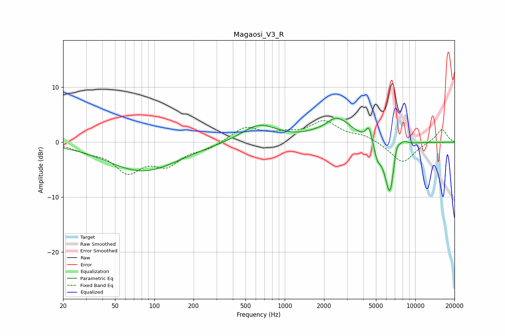

# Magaosi_V3_R
See [usage instructions](https://github.com/jaakkopasanen/AutoEq#usage) for more options and info.

### Parametric EQs
Apply preamp of -4.5 dB when using parametric equalizer.

|   # | Type    |   Fc (Hz) |    Q |   Gain (dB) |
|-----|---------|-----------|------|-------------|
|   1 | Peaking |        82 | 0.52 |        -5.3 |
|   2 | Peaking |       638 | 1.05 |         3.2 |
|   3 | Peaking |      2027 | 2.56 |        -0.6 |
|   4 | Peaking |      2471 | 1.21 |         4.6 |
|   5 | Peaking |      4422 | 6    |         2.8 |
|   6 | Peaking |      5132 | 5.46 |        -2.2 |
|   7 | Peaking |      5891 | 2.72 |        -0.9 |
|   8 | Peaking |      6404 | 3.67 |        -9.5 |
|   9 | Peaking |      7173 | 5.46 |         2.8 |
|  10 | Peaking |      8089 | 3.51 |         1.2 |

### Fixed Band EQs
When using fixed band (also called graphic) equalizer, apply preamp of **-4.0 dB** (if available) and set gains manually with these parameters.

|   # | Type    |   Fc (Hz) |    Q |   Gain (dB) |
|-----|---------|-----------|------|-------------|
|   1 | Peaking |        31 | 1.41 |        -1.2 |
|   2 | Peaking |        62 | 1.41 |        -5   |
|   3 | Peaking |       125 | 1.41 |        -3.6 |
|   4 | Peaking |       250 | 1.41 |        -1   |
|   5 | Peaking |       500 | 1.41 |         2.7 |
|   6 | Peaking |      1000 | 1.41 |         1.2 |
|   7 | Peaking |      2000 | 1.41 |         3.6 |
|   8 | Peaking |      4000 | 1.41 |         1.1 |
|   9 | Peaking |      8000 | 1.41 |        -3.9 |
|  10 | Peaking |     16000 | 1.41 |         2.5 |

### Graphs

