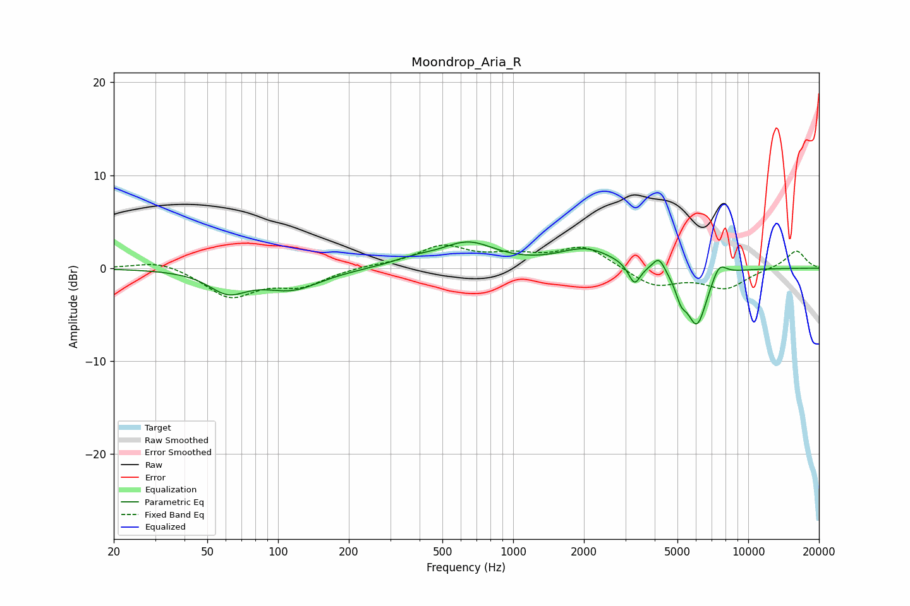

# Moondrop_Aria_R
See [usage instructions](https://github.com/jaakkopasanen/AutoEq#usage) for more options and info.

### Parametric EQs
Apply preamp of -2.9 dB when using parametric equalizer.

|   # | Type    |   Fc (Hz) |    Q |   Gain (dB) |
|-----|---------|-----------|------|-------------|
|   1 | Peaking |        61 | 1.78 |        -2.2 |
|   2 | Peaking |       114 | 1.13 |        -2.2 |
|   3 | Peaking |       374 | 1.48 |         0.7 |
|   4 | Peaking |       643 | 1.21 |         2.6 |
|   5 | Peaking |      2047 | 1.2  |         2   |
|   6 | Peaking |      3281 | 5.59 |        -2.2 |
|   7 | Peaking |      4170 | 5.36 |         1.6 |
|   8 | Peaking |      5178 | 5.92 |        -1.8 |
|   9 | Peaking |      6051 | 3.11 |        -6.1 |
|  10 | Peaking |      7520 | 4.31 |         1.7 |

### Fixed Band EQs
When using fixed band (also called graphic) equalizer, apply preamp of **-2.6 dB** (if available) and set gains manually with these parameters.

|   # | Type    |   Fc (Hz) |    Q |   Gain (dB) |
|-----|---------|-----------|------|-------------|
|   1 | Peaking |        31 | 1.41 |         0.9 |
|   2 | Peaking |        62 | 1.41 |        -3   |
|   3 | Peaking |       125 | 1.41 |        -1.7 |
|   4 | Peaking |       250 | 1.41 |         0.3 |
|   5 | Peaking |       500 | 1.41 |         2.2 |
|   6 | Peaking |      1000 | 1.41 |         1.1 |
|   7 | Peaking |      2000 | 1.41 |         2.3 |
|   8 | Peaking |      4000 | 1.41 |        -2   |
|   9 | Peaking |      8000 | 1.41 |        -2.1 |
|  10 | Peaking |     16000 | 1.41 |         2   |

### Graphs

