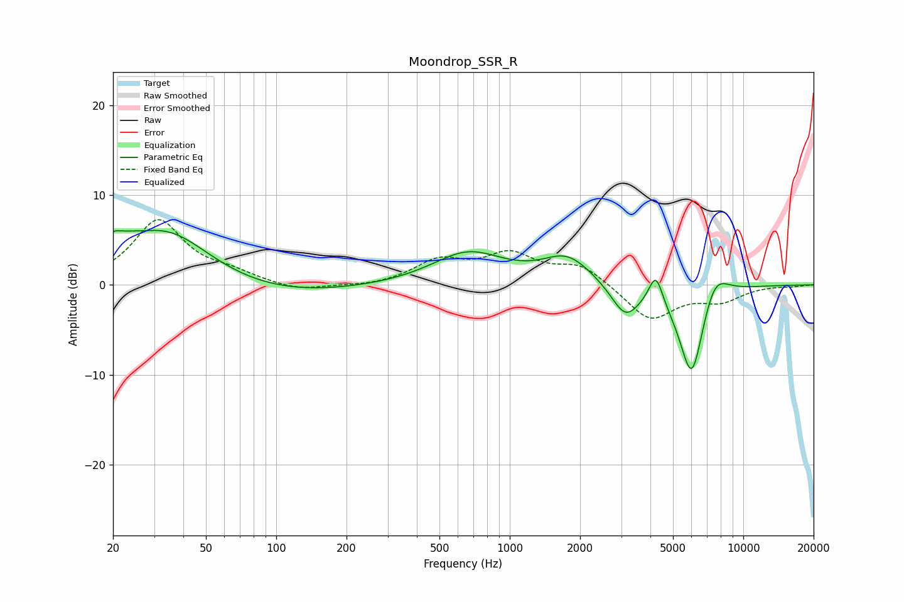

# Moondrop_SSR_R
See [usage instructions](https://github.com/jaakkopasanen/AutoEq#usage) for more options and info.

### Parametric EQs
Apply preamp of -6.2 dB when using parametric equalizer.

|   # | Type    |   Fc (Hz) |    Q |   Gain (dB) |
|-----|---------|-----------|------|-------------|
|   1 | Peaking |        20 | 5.84 |         0.6 |
|   2 | Peaking |        20 | 1.4  |         3.2 |
|   3 | Peaking |        31 | 0.18 |        -2.6 |
|   4 | Peaking |        34 | 0.69 |         7.5 |
|   5 | Peaking |       663 | 0.92 |         3.5 |
|   6 | Peaking |      1766 | 1.35 |         3   |
|   7 | Peaking |      3128 | 2.31 |        -3.6 |
|   8 | Peaking |      4220 | 4.8  |         3.4 |
|   9 | Peaking |      6017 | 2.46 |       -10.9 |
|  10 | Peaking |      7497 | 2.27 |         3.5 |

### Fixed Band EQs
When using fixed band (also called graphic) equalizer, apply preamp of **-7.3 dB** (if available) and set gains manually with these parameters.

|   # | Type    |   Fc (Hz) |    Q |   Gain (dB) |
|-----|---------|-----------|------|-------------|
|   1 | Peaking |        31 | 1.41 |         7.1 |
|   2 | Peaking |        62 | 1.41 |         1   |
|   3 | Peaking |       125 | 1.41 |        -0.8 |
|   4 | Peaking |       250 | 1.41 |        -0.3 |
|   5 | Peaking |       500 | 1.41 |         2.5 |
|   6 | Peaking |      1000 | 1.41 |         3.1 |
|   7 | Peaking |      2000 | 1.41 |         2.2 |
|   8 | Peaking |      4000 | 1.41 |        -3.9 |
|   9 | Peaking |      8000 | 1.41 |        -1.6 |
|  10 | Peaking |     16000 | 1.41 |        -0.1 |

### Graphs

