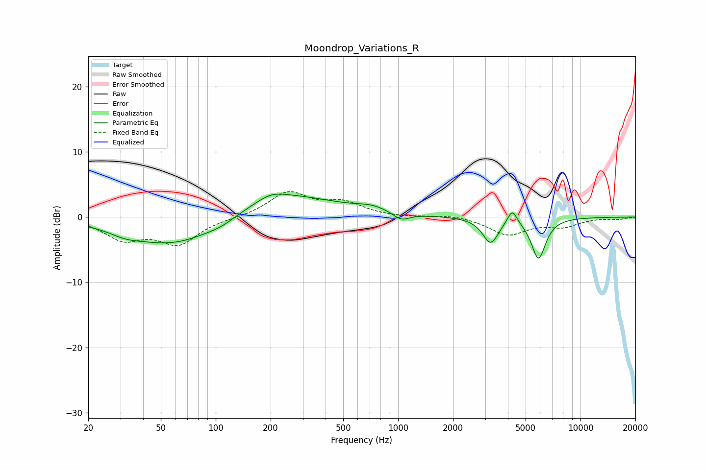

# Moondrop_Variations_R
See [usage instructions](https://github.com/jaakkopasanen/AutoEq#usage) for more options and info.

### Parametric EQs
Apply preamp of -3.6 dB when using parametric equalizer.

|   # | Type    |   Fc (Hz) |    Q |   Gain (dB) |
|-----|---------|-----------|------|-------------|
|   1 | Peaking |        32 | 1.71 |        -0.8 |
|   2 | Peaking |        60 | 0.57 |        -4.5 |
|   3 | Peaking |       107 | 1.74 |        -0.7 |
|   4 | Peaking |       201 | 1.87 |         1   |
|   5 | Peaking |       232 | 0.49 |         3.6 |
|   6 | Peaking |       723 | 1.59 |         0.8 |
|   7 | Peaking |      1038 | 3.09 |        -1.2 |
|   8 | Peaking |      3216 | 3.25 |        -3.9 |
|   9 | Peaking |      4224 | 5.27 |         2.3 |
|  10 | Peaking |      5885 | 3.53 |        -6.3 |

### Fixed Band EQs
When using fixed band (also called graphic) equalizer, apply preamp of **-4.0 dB** (if available) and set gains manually with these parameters.

|   # | Type    |   Fc (Hz) |    Q |   Gain (dB) |
|-----|---------|-----------|------|-------------|
|   1 | Peaking |        31 | 1.41 |        -3.1 |
|   2 | Peaking |        62 | 1.41 |        -3.9 |
|   3 | Peaking |       125 | 1.41 |        -0.1 |
|   4 | Peaking |       250 | 1.41 |         3.7 |
|   5 | Peaking |       500 | 1.41 |         2   |
|   6 | Peaking |      1000 | 1.41 |        -0.1 |
|   7 | Peaking |      2000 | 1.41 |         0.4 |
|   8 | Peaking |      4000 | 1.41 |        -2.7 |
|   9 | Peaking |      8000 | 1.41 |        -1.3 |
|  10 | Peaking |     16000 | 1.41 |        -0.3 |

### Graphs

