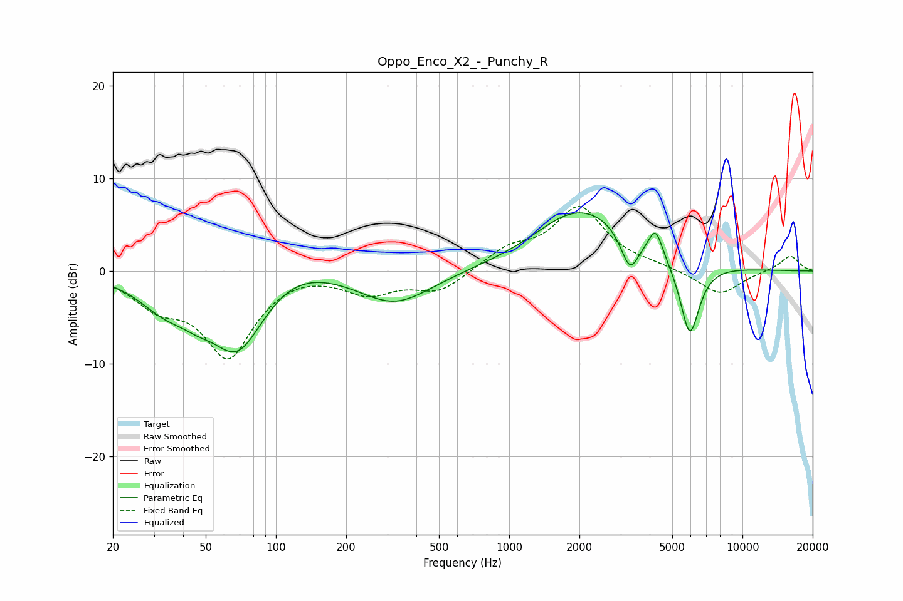

# Oppo_Enco_X2_-_Punchy_R
See [usage instructions](https://github.com/jaakkopasanen/AutoEq#usage) for more options and info.

### Parametric EQs
Apply preamp of -6.4 dB when using parametric equalizer.

|   # | Type    |   Fc (Hz) |    Q |   Gain (dB) |
|-----|---------|-----------|------|-------------|
|   1 | Peaking |        33 | 1.28 |        -2.9 |
|   2 | Peaking |        46 | 2.14 |        -1.1 |
|   3 | Peaking |        69 | 1.13 |        -8.9 |
|   4 | Peaking |       114 | 0.78 |         2.3 |
|   5 | Peaking |       323 | 0.89 |        -3.6 |
|   6 | Peaking |      1803 | 0.95 |         1.9 |
|   7 | Peaking |      2300 | 0.64 |         5.1 |
|   8 | Peaking |      3289 | 3.62 |        -4   |
|   9 | Peaking |      4244 | 4.76 |         2.9 |
|  10 | Peaking |      5943 | 3.25 |        -8.3 |

### Fixed Band EQs
When using fixed band (also called graphic) equalizer, apply preamp of **-7.1 dB** (if available) and set gains manually with these parameters.

|   # | Type    |   Fc (Hz) |    Q |   Gain (dB) |
|-----|---------|-----------|------|-------------|
|   1 | Peaking |        31 | 1.41 |        -3   |
|   2 | Peaking |        62 | 1.41 |        -8.9 |
|   3 | Peaking |       125 | 1.41 |         0.4 |
|   4 | Peaking |       250 | 1.41 |        -2.2 |
|   5 | Peaking |       500 | 1.41 |        -2.2 |
|   6 | Peaking |      1000 | 1.41 |         2.1 |
|   7 | Peaking |      2000 | 1.41 |         6.7 |
|   8 | Peaking |      4000 | 1.41 |         0.4 |
|   9 | Peaking |      8000 | 1.41 |        -2.6 |
|  10 | Peaking |     16000 | 1.41 |         1.7 |

### Graphs

