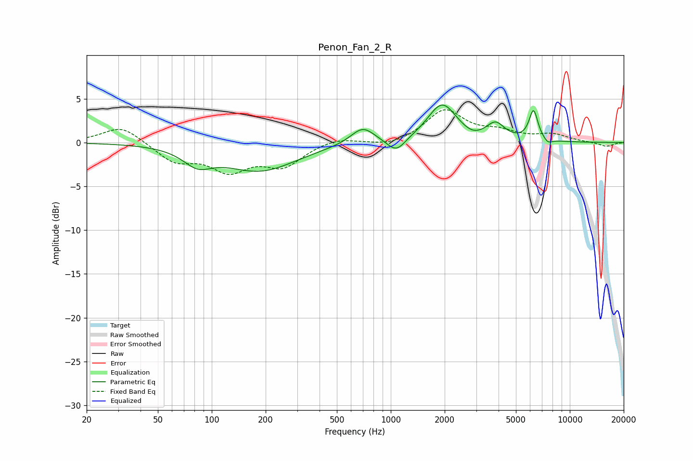

# Penon_Fan_2_R
See [usage instructions](https://github.com/jaakkopasanen/AutoEq#usage) for more options and info.

### Parametric EQs
Apply preamp of -4.4 dB when using parametric equalizer.

|   # | Type    |   Fc (Hz) |    Q |   Gain (dB) |
|-----|---------|-----------|------|-------------|
|   1 | Peaking |        83 | 1.8  |        -1.8 |
|   2 | Peaking |       186 | 0.7  |        -3.2 |
|   3 | Peaking |       677 | 1.77 |         0.2 |
|   4 | Peaking |       698 | 2.17 |         1.7 |
|   5 | Peaking |      1073 | 2.75 |        -1.6 |
|   6 | Peaking |      1936 | 1.74 |         4.4 |
|   7 | Peaking |      2850 | 2.74 |        -0.5 |
|   8 | Peaking |      3850 | 2.81 |         1.8 |
|   9 | Peaking |      6269 | 5.56 |         3.4 |
|  10 | Peaking |      7542 | 5.71 |        -0.5 |

### Fixed Band EQs
When using fixed band (also called graphic) equalizer, apply preamp of **-3.8 dB** (if available) and set gains manually with these parameters.

|   # | Type    |   Fc (Hz) |    Q |   Gain (dB) |
|-----|---------|-----------|------|-------------|
|   1 | Peaking |        31 | 1.41 |         2   |
|   2 | Peaking |        62 | 1.41 |        -2.1 |
|   3 | Peaking |       125 | 1.41 |        -2.9 |
|   4 | Peaking |       250 | 1.41 |        -2.5 |
|   5 | Peaking |       500 | 1.41 |         0.6 |
|   6 | Peaking |      1000 | 1.41 |        -0.5 |
|   7 | Peaking |      2000 | 1.41 |         3.6 |
|   8 | Peaking |      4000 | 1.41 |         1   |
|   9 | Peaking |      8000 | 1.41 |         0.8 |
|  10 | Peaking |     16000 | 1.41 |        -0.5 |

### Graphs

