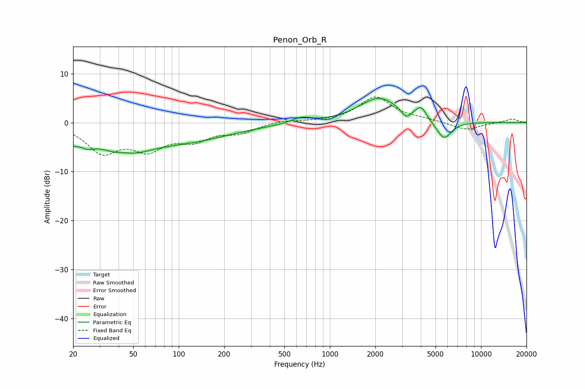

# Penon_Orb_R
See [usage instructions](https://github.com/jaakkopasanen/AutoEq#usage) for more options and info.

### Parametric EQs
Apply preamp of -5.1 dB when using parametric equalizer.

|   # | Type    |   Fc (Hz) |    Q |   Gain (dB) |
|-----|---------|-----------|------|-------------|
|   1 | Peaking |        20 | 5.31 |        -1.7 |
|   2 | Peaking |        24 | 2.67 |        -2.1 |
|   3 | Peaking |        43 | 0.92 |        -5.5 |
|   4 | Peaking |        44 | 2.18 |         1.1 |
|   5 | Peaking |       114 | 0.47 |        -3.3 |
|   6 | Peaking |       647 | 2.38 |         1.1 |
|   7 | Peaking |      2115 | 1.08 |         5.1 |
|   8 | Peaking |      3182 | 4.91 |        -1.6 |
|   9 | Peaking |      4008 | 4.15 |         2.5 |
|  10 | Peaking |      5690 | 2.76 |        -3.8 |

### Fixed Band EQs
When using fixed band (also called graphic) equalizer, apply preamp of **-5.3 dB** (if available) and set gains manually with these parameters.

|   # | Type    |   Fc (Hz) |    Q |   Gain (dB) |
|-----|---------|-----------|------|-------------|
|   1 | Peaking |        31 | 1.41 |        -5.6 |
|   2 | Peaking |        62 | 1.41 |        -4.7 |
|   3 | Peaking |       125 | 1.41 |        -3   |
|   4 | Peaking |       250 | 1.41 |        -1.8 |
|   5 | Peaking |       500 | 1.41 |         0.5 |
|   6 | Peaking |      1000 | 1.41 |         0.2 |
|   7 | Peaking |      2000 | 1.41 |         5.2 |
|   8 | Peaking |      4000 | 1.41 |         0.5 |
|   9 | Peaking |      8000 | 1.41 |        -1.6 |
|  10 | Peaking |     16000 | 1.41 |         0.8 |

### Graphs

