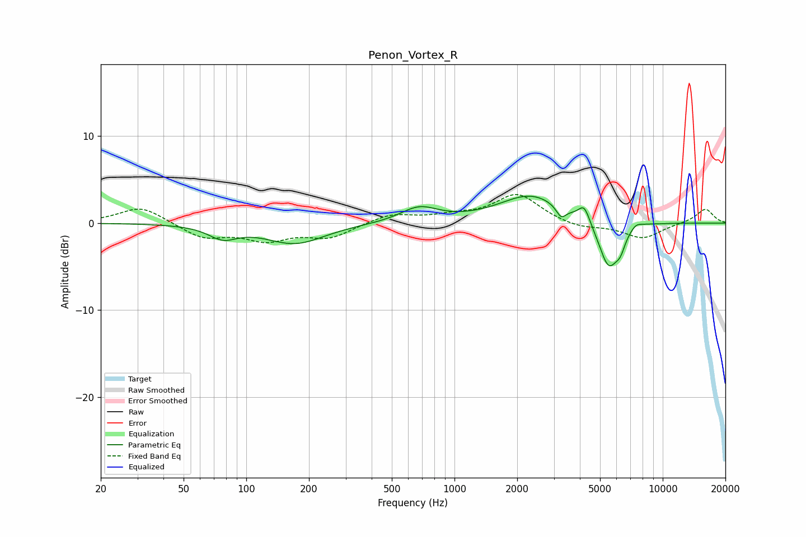

# Penon_Vortex_R
See [usage instructions](https://github.com/jaakkopasanen/AutoEq#usage) for more options and info.

### Parametric EQs
Apply preamp of -3.2 dB when using parametric equalizer.

|   # | Type    |   Fc (Hz) |    Q |   Gain (dB) |
|-----|---------|-----------|------|-------------|
|   1 | Peaking |        77 | 2.09 |        -1.4 |
|   2 | Peaking |       172 | 1    |        -2.3 |
|   3 | Peaking |       677 | 1.58 |         1.7 |
|   4 | Peaking |      2336 | 0.93 |         3.2 |
|   5 | Peaking |      3252 | 6    |        -1.3 |
|   6 | Peaking |      4199 | 5.22 |         1.9 |
|   7 | Peaking |      5503 | 2.85 |        -5.4 |
|   8 | Peaking |      6265 | 5.98 |        -1.4 |
|   9 | Peaking |      7416 | 5.15 |         0.5 |
|  10 | Peaking |      7908 | 3.24 |         0.1 |

### Fixed Band EQs
When using fixed band (also called graphic) equalizer, apply preamp of **-3.4 dB** (if available) and set gains manually with these parameters.

|   # | Type    |   Fc (Hz) |    Q |   Gain (dB) |
|-----|---------|-----------|------|-------------|
|   1 | Peaking |        31 | 1.41 |         2   |
|   2 | Peaking |        62 | 1.41 |        -1.7 |
|   3 | Peaking |       125 | 1.41 |        -1.8 |
|   4 | Peaking |       250 | 1.41 |        -1.6 |
|   5 | Peaking |       500 | 1.41 |         1   |
|   6 | Peaking |      1000 | 1.41 |         0.7 |
|   7 | Peaking |      2000 | 1.41 |         3.3 |
|   8 | Peaking |      4000 | 1.41 |        -0.6 |
|   9 | Peaking |      8000 | 1.41 |        -1.8 |
|  10 | Peaking |     16000 | 1.41 |         1.7 |

### Graphs

