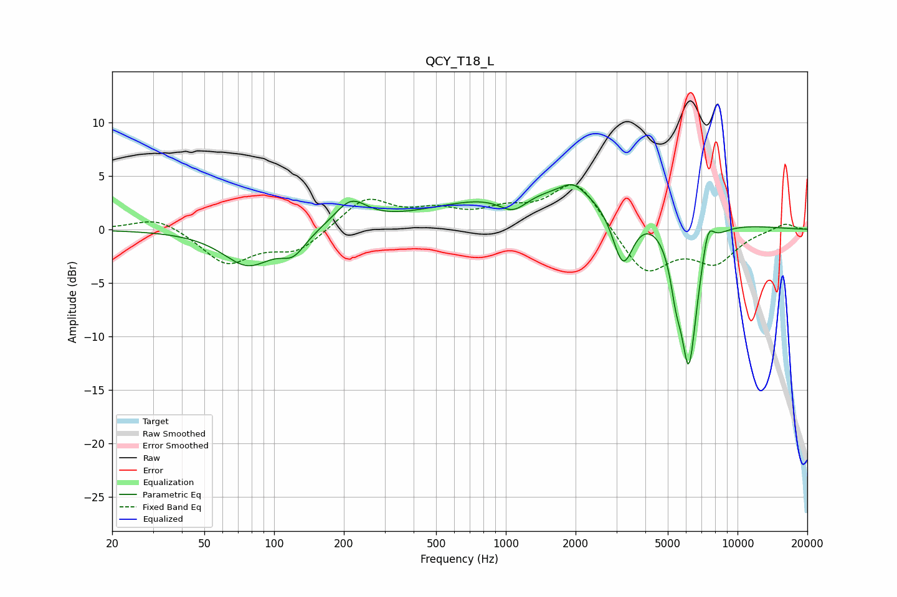

# QCY_T18_L
See [usage instructions](https://github.com/jaakkopasanen/AutoEq#usage) for more options and info.

### Parametric EQs
Apply preamp of -4.3 dB when using parametric equalizer.

|   # | Type    |   Fc (Hz) |    Q |   Gain (dB) |
|-----|---------|-----------|------|-------------|
|   1 | Peaking |        77 | 1.3  |        -3.3 |
|   2 | Peaking |       121 | 2.65 |        -1.8 |
|   3 | Peaking |       214 | 2.01 |         2.4 |
|   4 | Peaking |      1075 | 2.25 |        -1.7 |
|   5 | Peaking |      1878 | 0.26 |         4   |
|   6 | Peaking |      1943 | 2.84 |         1.1 |
|   7 | Peaking |      3202 | 3.03 |        -5.8 |
|   8 | Peaking |      5420 | 5.98 |        -2.7 |
|   9 | Peaking |      6161 | 3.31 |       -14.4 |
|  10 | Peaking |      7449 | 5.27 |         2.8 |

### Fixed Band EQs
When using fixed band (also called graphic) equalizer, apply preamp of **-4.2 dB** (if available) and set gains manually with these parameters.

|   # | Type    |   Fc (Hz) |    Q |   Gain (dB) |
|-----|---------|-----------|------|-------------|
|   1 | Peaking |        31 | 1.41 |         1.3 |
|   2 | Peaking |        62 | 1.41 |        -3.2 |
|   3 | Peaking |       125 | 1.41 |        -2   |
|   4 | Peaking |       250 | 1.41 |         2.9 |
|   5 | Peaking |       500 | 1.41 |         1.4 |
|   6 | Peaking |      1000 | 1.41 |         1.4 |
|   7 | Peaking |      2000 | 1.41 |         4.6 |
|   8 | Peaking |      4000 | 1.41 |        -4.3 |
|   9 | Peaking |      8000 | 1.41 |        -2.9 |
|  10 | Peaking |     16000 | 1.41 |         0.6 |

### Graphs

