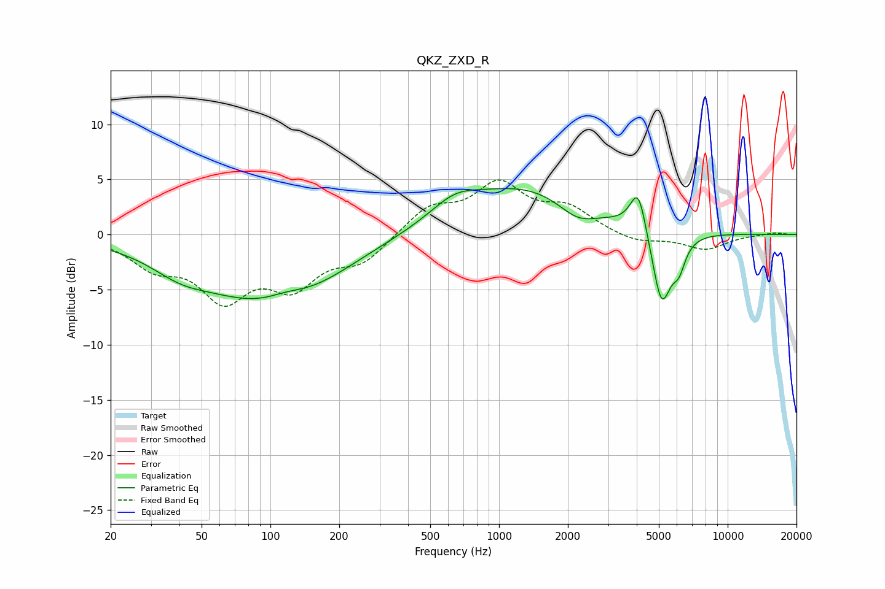

# QKZ_ZXD_R
See [usage instructions](https://github.com/jaakkopasanen/AutoEq#usage) for more options and info.

### Parametric EQs
Apply preamp of -4.3 dB when using parametric equalizer.

|   # | Type    |   Fc (Hz) |    Q |   Gain (dB) |
|-----|---------|-----------|------|-------------|
|   1 | Peaking |        40 | 1.2  |        -1.2 |
|   2 | Peaking |        93 | 0.46 |        -5.8 |
|   3 | Peaking |       116 | 1.87 |         0.5 |
|   4 | Peaking |       170 | 1.03 |        -0.4 |
|   5 | Peaking |       637 | 1.36 |         1.6 |
|   6 | Peaking |      1318 | 0.48 |         4.3 |
|   7 | Peaking |      2202 | 1.6  |        -1.8 |
|   8 | Peaking |      4066 | 3.99 |         4.1 |
|   9 | Peaking |      5140 | 3.21 |        -7   |
|  10 | Peaking |      6125 | 4.92 |        -2.1 |

### Fixed Band EQs
When using fixed band (also called graphic) equalizer, apply preamp of **-5.0 dB** (if available) and set gains manually with these parameters.

|   # | Type    |   Fc (Hz) |    Q |   Gain (dB) |
|-----|---------|-----------|------|-------------|
|   1 | Peaking |        31 | 1.41 |        -2.5 |
|   2 | Peaking |        62 | 1.41 |        -5.2 |
|   3 | Peaking |       125 | 1.41 |        -4.1 |
|   4 | Peaking |       250 | 1.41 |        -2.3 |
|   5 | Peaking |       500 | 1.41 |         2.4 |
|   6 | Peaking |      1000 | 1.41 |         4.3 |
|   7 | Peaking |      2000 | 1.41 |         2.1 |
|   8 | Peaking |      4000 | 1.41 |        -0.8 |
|   9 | Peaking |      8000 | 1.41 |        -1.3 |
|  10 | Peaking |     16000 | 1.41 |         0.2 |

### Graphs

