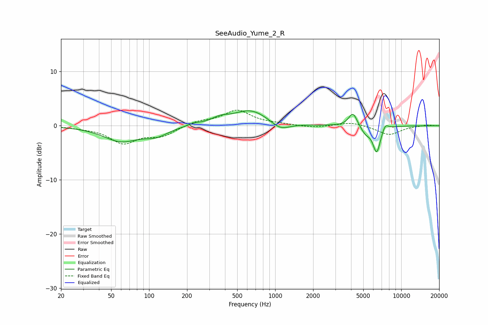

# SeeAudio_Yume_2_R
See [usage instructions](https://github.com/jaakkopasanen/AutoEq#usage) for more options and info.

### Parametric EQs
Apply preamp of -2.9 dB when using parametric equalizer.

|   # | Type    |   Fc (Hz) |    Q |   Gain (dB) |
|-----|---------|-----------|------|-------------|
|   1 | Peaking |        60 | 1.02 |        -2.7 |
|   2 | Peaking |       114 | 1.52 |        -1.4 |
|   3 | Peaking |       228 | 2.77 |         0.4 |
|   4 | Peaking |       364 | 2.17 |         0.9 |
|   5 | Peaking |       637 | 1.02 |         2.9 |
|   6 | Peaking |      1099 | 1.93 |        -1.5 |
|   7 | Peaking |      4138 | 4.13 |         2.6 |
|   8 | Peaking |      5214 | 3.68 |        -1.3 |
|   9 | Peaking |      6384 | 4.55 |        -4.8 |
|  10 | Peaking |      7481 | 5.83 |         1.1 |

### Fixed Band EQs
When using fixed band (also called graphic) equalizer, apply preamp of **-3.0 dB** (if available) and set gains manually with these parameters.

|   # | Type    |   Fc (Hz) |    Q |   Gain (dB) |
|-----|---------|-----------|------|-------------|
|   1 | Peaking |        31 | 1.41 |        -0.3 |
|   2 | Peaking |        62 | 1.41 |        -3.1 |
|   3 | Peaking |       125 | 1.41 |        -1.7 |
|   4 | Peaking |       250 | 1.41 |         0.8 |
|   5 | Peaking |       500 | 1.41 |         2.8 |
|   6 | Peaking |      1000 | 1.41 |         0.3 |
|   7 | Peaking |      2000 | 1.41 |        -0.4 |
|   8 | Peaking |      4000 | 1.41 |         0.7 |
|   9 | Peaking |      8000 | 1.41 |        -1.7 |
|  10 | Peaking |     16000 | 1.41 |         0.2 |

### Graphs

