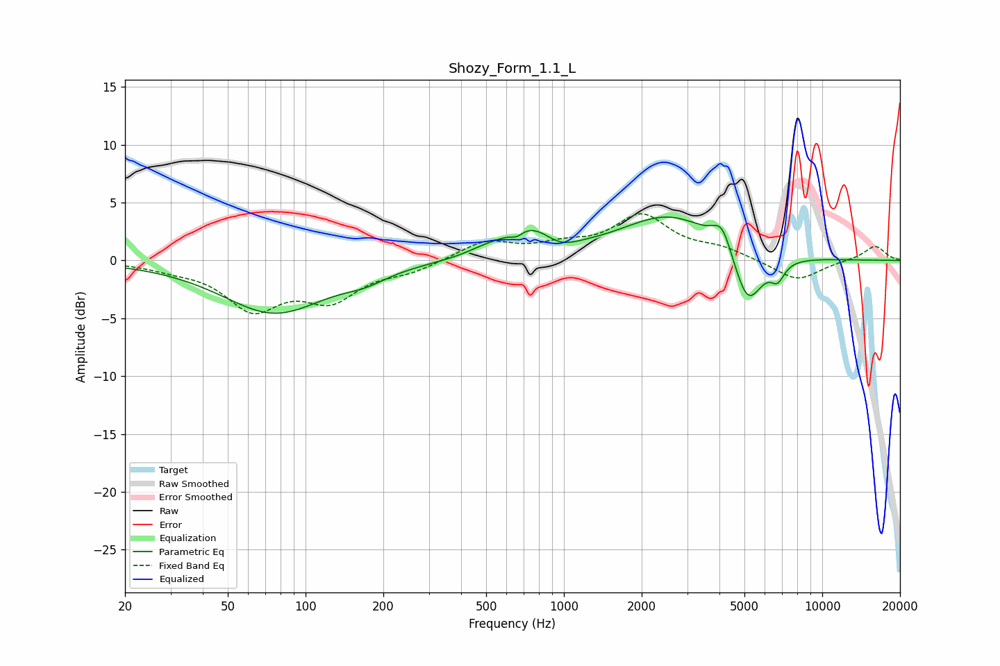

# Shozy_Form_1.1_L
See [usage instructions](https://github.com/jaakkopasanen/AutoEq#usage) for more options and info.

### Parametric EQs
Apply preamp of -3.8 dB when using parametric equalizer.

|   # | Type    |   Fc (Hz) |    Q |   Gain (dB) |
|-----|---------|-----------|------|-------------|
|   1 | Peaking |        76 | 0.7  |        -4.5 |
|   2 | Peaking |       170 | 1.68 |        -0.7 |
|   3 | Peaking |       501 | 1.88 |         0.5 |
|   4 | Peaking |       658 | 6    |        -0.5 |
|   5 | Peaking |       736 | 1.46 |         2.5 |
|   6 | Peaking |       963 | 2.28 |        -0.8 |
|   7 | Peaking |      2561 | 0.75 |         3.8 |
|   8 | Peaking |      4093 | 3.76 |         2.2 |
|   9 | Peaking |      5146 | 2.46 |        -4.9 |
|  10 | Peaking |      6722 | 5.06 |        -1.5 |

### Fixed Band EQs
When using fixed band (also called graphic) equalizer, apply preamp of **-4.1 dB** (if available) and set gains manually with these parameters.

|   # | Type    |   Fc (Hz) |    Q |   Gain (dB) |
|-----|---------|-----------|------|-------------|
|   1 | Peaking |        31 | 1.41 |        -0.5 |
|   2 | Peaking |        62 | 1.41 |        -3.9 |
|   3 | Peaking |       125 | 1.41 |        -3.1 |
|   4 | Peaking |       250 | 1.41 |        -0.8 |
|   5 | Peaking |       500 | 1.41 |         1.6 |
|   6 | Peaking |      1000 | 1.41 |         1   |
|   7 | Peaking |      2000 | 1.41 |         3.7 |
|   8 | Peaking |      4000 | 1.41 |         0.9 |
|   9 | Peaking |      8000 | 1.41 |        -1.8 |
|  10 | Peaking |     16000 | 1.41 |         1.3 |

### Graphs

