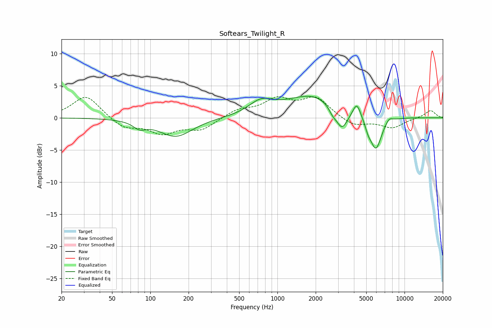

# Softears_Twilight_R
See [usage instructions](https://github.com/jaakkopasanen/AutoEq#usage) for more options and info.

### Parametric EQs
Apply preamp of -3.4 dB when using parametric equalizer.

|   # | Type    |   Fc (Hz) |    Q |   Gain (dB) |
|-----|---------|-----------|------|-------------|
|   1 | Peaking |        82 | 2.92 |        -1.1 |
|   2 | Peaking |       159 | 1.08 |        -2.9 |
|   3 | Peaking |       744 | 1.48 |         2   |
|   4 | Peaking |      1897 | 0.69 |         3.5 |
|   5 | Peaking |      2711 | 4.8  |        -0.9 |
|   6 | Peaking |      3208 | 3.01 |        -3.3 |
|   7 | Peaking |      4210 | 4.57 |         2.3 |
|   8 | Peaking |      5166 | 6    |        -1.1 |
|   9 | Peaking |      5943 | 3    |        -5.2 |
|  10 | Peaking |      7556 | 4.99 |         0.8 |

### Fixed Band EQs
When using fixed band (also called graphic) equalizer, apply preamp of **-3.4 dB** (if available) and set gains manually with these parameters.

|   # | Type    |   Fc (Hz) |    Q |   Gain (dB) |
|-----|---------|-----------|------|-------------|
|   1 | Peaking |        31 | 1.41 |         3.5 |
|   2 | Peaking |        62 | 1.41 |        -1.6 |
|   3 | Peaking |       125 | 1.41 |        -2.2 |
|   4 | Peaking |       250 | 1.41 |        -1.8 |
|   5 | Peaking |       500 | 1.41 |         1.2 |
|   6 | Peaking |      1000 | 1.41 |         2.6 |
|   7 | Peaking |      2000 | 1.41 |         3   |
|   8 | Peaking |      4000 | 1.41 |        -1.4 |
|   9 | Peaking |      8000 | 1.41 |        -1.5 |
|  10 | Peaking |     16000 | 1.41 |         1.2 |

### Graphs

