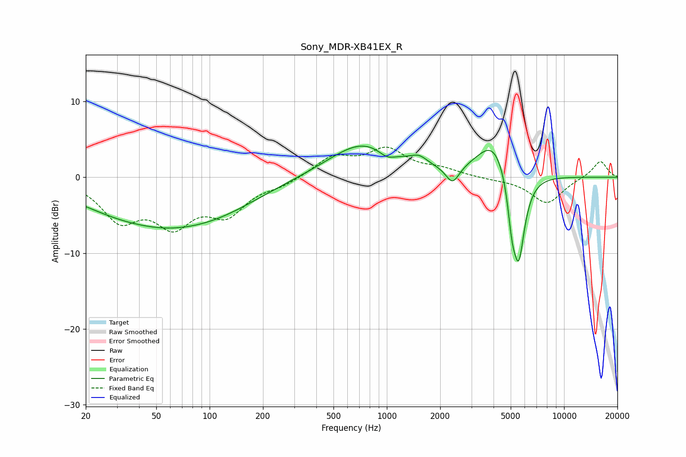

# Sony_MDR-XB41EX_R
See [usage instructions](https://github.com/jaakkopasanen/AutoEq#usage) for more options and info.

### Parametric EQs
Apply preamp of -4.2 dB when using parametric equalizer.

|   # | Type    |   Fc (Hz) |    Q |   Gain (dB) |
|-----|---------|-----------|------|-------------|
|   1 | Peaking |        41 | 1.1  |         0.3 |
|   2 | Peaking |        44 | 0.42 |        -5.7 |
|   3 | Peaking |       114 | 0.55 |        -2.5 |
|   4 | Peaking |       733 | 0.73 |         4.6 |
|   5 | Peaking |      1002 | 2.97 |        -1   |
|   6 | Peaking |      1521 | 3    |         1   |
|   7 | Peaking |      2350 | 3.71 |        -2.4 |
|   8 | Peaking |      4028 | 1.48 |         5.1 |
|   9 | Peaking |      5080 | 6    |        -4.4 |
|  10 | Peaking |      5550 | 3.78 |       -11.7 |

### Fixed Band EQs
When using fixed band (also called graphic) equalizer, apply preamp of **-4.1 dB** (if available) and set gains manually with these parameters.

|   # | Type    |   Fc (Hz) |    Q |   Gain (dB) |
|-----|---------|-----------|------|-------------|
|   1 | Peaking |        31 | 1.41 |        -5.1 |
|   2 | Peaking |        62 | 1.41 |        -5.5 |
|   3 | Peaking |       125 | 1.41 |        -4.3 |
|   4 | Peaking |       250 | 1.41 |        -0.9 |
|   5 | Peaking |       500 | 1.41 |         2.6 |
|   6 | Peaking |      1000 | 1.41 |         3.4 |
|   7 | Peaking |      2000 | 1.41 |         0.9 |
|   8 | Peaking |      4000 | 1.41 |        -0.2 |
|   9 | Peaking |      8000 | 1.41 |        -3.4 |
|  10 | Peaking |     16000 | 1.41 |         2.2 |

### Graphs

