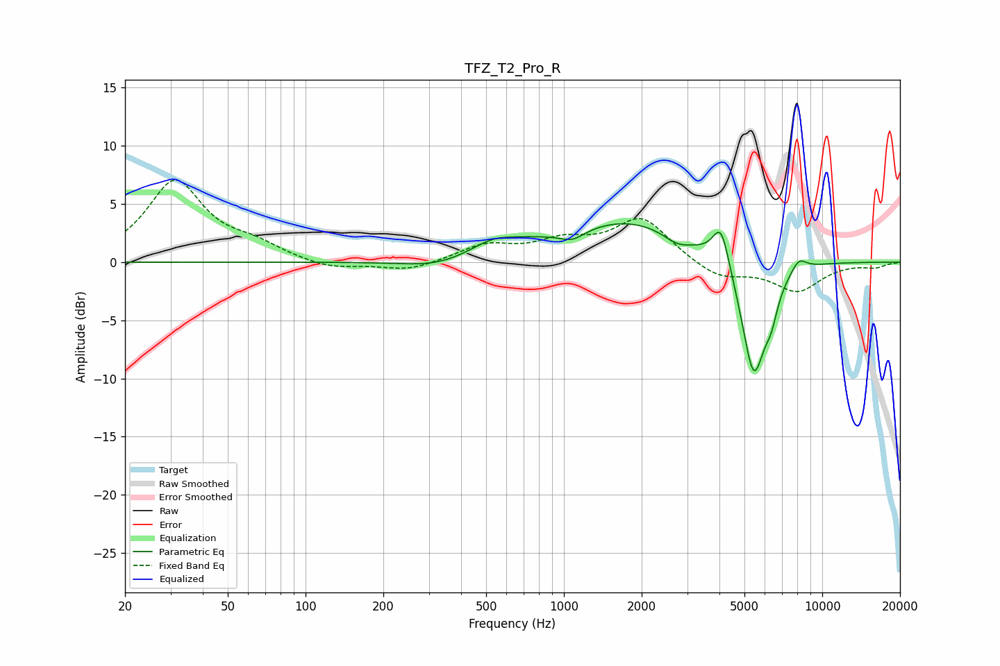

# TFZ_T2_Pro_R
See [usage instructions](https://github.com/jaakkopasanen/AutoEq#usage) for more options and info.

### Parametric EQs
Apply preamp of -3.4 dB when using parametric equalizer.

|   # | Type    |   Fc (Hz) |    Q |   Gain (dB) |
|-----|---------|-----------|------|-------------|
|   1 | Peaking |       318 | 1.08 |        -0.7 |
|   2 | Peaking |       526 | 1.67 |         1.1 |
|   3 | Peaking |       679 | 1.37 |         0.4 |
|   4 | Peaking |      1080 | 2.88 |        -0.9 |
|   5 | Peaking |      1785 | 0.54 |         3.6 |
|   6 | Peaking |      2740 | 2.6  |        -0.9 |
|   7 | Peaking |      4060 | 4.39 |         3.6 |
|   8 | Peaking |      5432 | 2.79 |       -10.4 |
|   9 | Peaking |      6353 | 5.57 |        -1.9 |
|  10 | Peaking |      8105 | 4.36 |         1.1 |

### Fixed Band EQs
When using fixed band (also called graphic) equalizer, apply preamp of **-7.2 dB** (if available) and set gains manually with these parameters.

|   # | Type    |   Fc (Hz) |    Q |   Gain (dB) |
|-----|---------|-----------|------|-------------|
|   1 | Peaking |        31 | 1.41 |         6.9 |
|   2 | Peaking |        62 | 1.41 |         1.2 |
|   3 | Peaking |       125 | 1.41 |        -0.7 |
|   4 | Peaking |       250 | 1.41 |        -0.8 |
|   5 | Peaking |       500 | 1.41 |         1.4 |
|   6 | Peaking |      1000 | 1.41 |         1.5 |
|   7 | Peaking |      2000 | 1.41 |         3.7 |
|   8 | Peaking |      4000 | 1.41 |        -1.4 |
|   9 | Peaking |      8000 | 1.41 |        -2.4 |
|  10 | Peaking |     16000 | 1.41 |        -0.4 |

### Graphs

