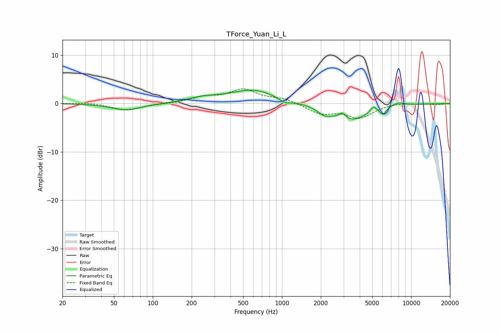

# TForce_Yuan_Li_L
See [usage instructions](https://github.com/jaakkopasanen/AutoEq#usage) for more options and info.

### Parametric EQs
Apply preamp of -2.8 dB when using parametric equalizer.

|   # | Type    |   Fc (Hz) |    Q |   Gain (dB) |
|-----|---------|-----------|------|-------------|
|   1 | Peaking |        62 | 1.25 |        -1.4 |
|   2 | Peaking |       241 | 1.3  |         0.8 |
|   3 | Peaking |       602 | 0.74 |         2.8 |
|   4 | Peaking |      1052 | 2.85 |        -1   |
|   5 | Peaking |      2118 | 2.85 |        -1.1 |
|   6 | Peaking |      2939 | 5.45 |         1.3 |
|   7 | Peaking |      3353 | 0.97 |        -3.6 |
|   8 | Peaking |      5110 | 6    |         1.2 |
|   9 | Peaking |      6075 | 5.99 |        -1.4 |
|  10 | Peaking |      7884 | 2.53 |         0.7 |

### Fixed Band EQs
When using fixed band (also called graphic) equalizer, apply preamp of **-3.1 dB** (if available) and set gains manually with these parameters.

|   # | Type    |   Fc (Hz) |    Q |   Gain (dB) |
|-----|---------|-----------|------|-------------|
|   1 | Peaking |        31 | 1.41 |         0.2 |
|   2 | Peaking |        62 | 1.41 |        -1.4 |
|   3 | Peaking |       125 | 1.41 |        -0.1 |
|   4 | Peaking |       250 | 1.41 |         1.2 |
|   5 | Peaking |       500 | 1.41 |         2.7 |
|   6 | Peaking |      1000 | 1.41 |         1   |
|   7 | Peaking |      2000 | 1.41 |        -2   |
|   8 | Peaking |      4000 | 1.41 |        -2.8 |
|   9 | Peaking |      8000 | 1.41 |         0.2 |
|  10 | Peaking |     16000 | 1.41 |        -0.2 |

### Graphs

