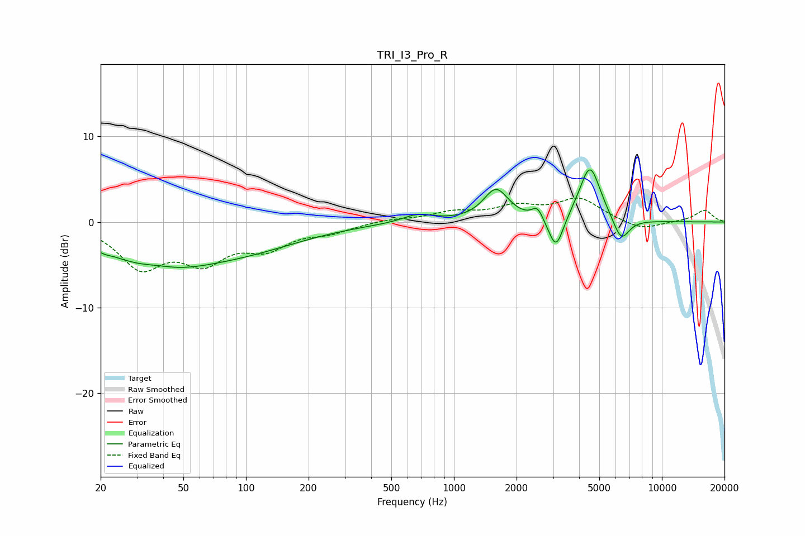

# TRI_I3_Pro_R
See [usage instructions](https://github.com/jaakkopasanen/AutoEq#usage) for more options and info.

### Parametric EQs
Apply preamp of -6.2 dB when using parametric equalizer.

|   # | Type    |   Fc (Hz) |    Q |   Gain (dB) |
|-----|---------|-----------|------|-------------|
|   1 | Peaking |        21 | 5.71 |        -0.2 |
|   2 | Peaking |        36 | 0.56 |        -4.7 |
|   3 | Peaking |        37 | 1.57 |         0.6 |
|   4 | Peaking |       102 | 0.5  |        -2.5 |
|   5 | Peaking |       672 | 1.86 |         1   |
|   6 | Peaking |      1594 | 2.35 |         3.7 |
|   7 | Peaking |      2521 | 5.37 |         1.4 |
|   8 | Peaking |      3097 | 3.95 |        -4   |
|   9 | Peaking |      4508 | 2.73 |         6.7 |
|  10 | Peaking |      6369 | 3.52 |        -2.8 |

### Fixed Band EQs
When using fixed band (also called graphic) equalizer, apply preamp of **-2.9 dB** (if available) and set gains manually with these parameters.

|   # | Type    |   Fc (Hz) |    Q |   Gain (dB) |
|-----|---------|-----------|------|-------------|
|   1 | Peaking |        31 | 1.41 |        -5   |
|   2 | Peaking |        62 | 1.41 |        -4   |
|   3 | Peaking |       125 | 1.41 |        -2.6 |
|   4 | Peaking |       250 | 1.41 |        -1   |
|   5 | Peaking |       500 | 1.41 |         0.3 |
|   6 | Peaking |      1000 | 1.41 |         1   |
|   7 | Peaking |      2000 | 1.41 |         1.6 |
|   8 | Peaking |      4000 | 1.41 |         2.6 |
|   9 | Peaking |      8000 | 1.41 |        -1   |
|  10 | Peaking |     16000 | 1.41 |         1.4 |

### Graphs

