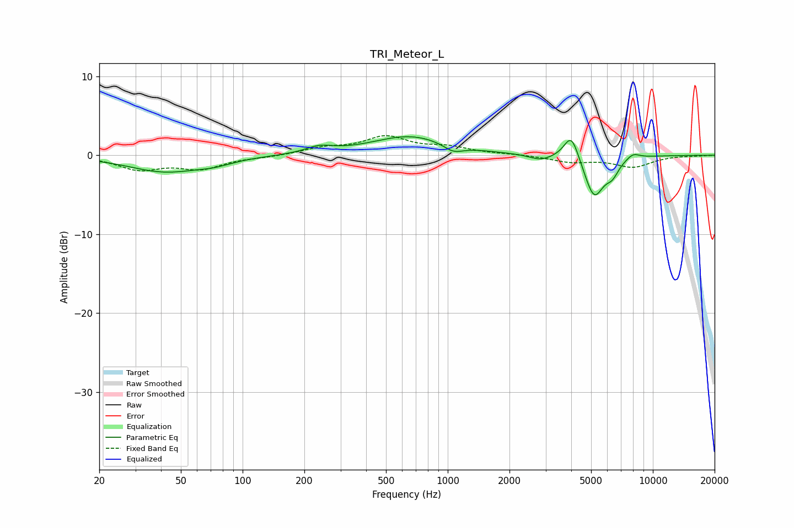

# TRI_Meteor_L
See [usage instructions](https://github.com/jaakkopasanen/AutoEq#usage) for more options and info.

### Parametric EQs
Apply preamp of -2.4 dB when using parametric equalizer.

|   # | Type    |   Fc (Hz) |    Q |   Gain (dB) |
|-----|---------|-----------|------|-------------|
|   1 | Peaking |        42 | 0.79 |        -2   |
|   2 | Peaking |        73 | 1.67 |        -0.5 |
|   3 | Peaking |       236 | 2.11 |         0.8 |
|   4 | Peaking |       658 | 0.76 |         2.4 |
|   5 | Peaking |      1065 | 2.91 |        -1   |
|   6 | Peaking |      2833 | 2.64 |        -0.7 |
|   7 | Peaking |      4008 | 3.86 |         3.4 |
|   8 | Peaking |      5171 | 2.92 |        -5.3 |
|   9 | Peaking |      6346 | 4.28 |        -1.6 |
|  10 | Peaking |      8002 | 4.07 |         0.7 |

### Fixed Band EQs
When using fixed band (also called graphic) equalizer, apply preamp of **-2.6 dB** (if available) and set gains manually with these parameters.

|   # | Type    |   Fc (Hz) |    Q |   Gain (dB) |
|-----|---------|-----------|------|-------------|
|   1 | Peaking |        31 | 1.41 |        -1.7 |
|   2 | Peaking |        62 | 1.41 |        -1.6 |
|   3 | Peaking |       125 | 1.41 |        -0.2 |
|   4 | Peaking |       250 | 1.41 |         0.8 |
|   5 | Peaking |       500 | 1.41 |         2.2 |
|   6 | Peaking |      1000 | 1.41 |         0.9 |
|   7 | Peaking |      2000 | 1.41 |         0.1 |
|   8 | Peaking |      4000 | 1.41 |        -0.8 |
|   9 | Peaking |      8000 | 1.41 |        -1.4 |
|  10 | Peaking |     16000 | 1.41 |        -0.1 |

### Graphs

