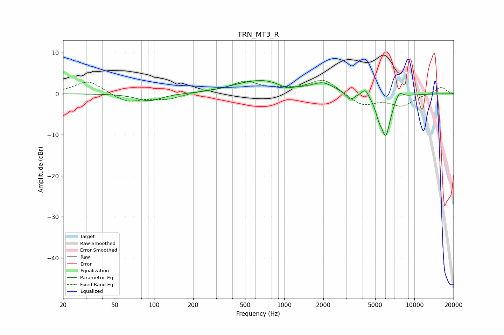

# TRN_MT3_R
See [usage instructions](https://github.com/jaakkopasanen/AutoEq#usage) for more options and info.

### Parametric EQs
Apply preamp of -3.3 dB when using parametric equalizer.

|   # | Type    |   Fc (Hz) |    Q |   Gain (dB) |
|-----|---------|-----------|------|-------------|
|   1 | Peaking |        92 | 1.55 |        -1.8 |
|   2 | Peaking |       424 | 1.21 |         0.5 |
|   3 | Peaking |       681 | 0.81 |         3   |
|   4 | Peaking |      1034 | 3.08 |        -0.9 |
|   5 | Peaking |      1986 | 1.68 |         2.3 |
|   6 | Peaking |      3221 | 4.6  |        -1.8 |
|   7 | Peaking |      4196 | 5.36 |         2   |
|   8 | Peaking |      5321 | 5.82 |        -2.3 |
|   9 | Peaking |      6024 | 3.53 |       -10   |
|  10 | Peaking |      7618 | 4.37 |         2.1 |

### Fixed Band EQs
When using fixed band (also called graphic) equalizer, apply preamp of **-3.4 dB** (if available) and set gains manually with these parameters.

|   # | Type    |   Fc (Hz) |    Q |   Gain (dB) |
|-----|---------|-----------|------|-------------|
|   1 | Peaking |        31 | 1.41 |         3.2 |
|   2 | Peaking |        62 | 1.41 |        -2.1 |
|   3 | Peaking |       125 | 1.41 |        -1.3 |
|   4 | Peaking |       250 | 1.41 |         0.5 |
|   5 | Peaking |       500 | 1.41 |         2.8 |
|   6 | Peaking |      1000 | 1.41 |         0.8 |
|   7 | Peaking |      2000 | 1.41 |         3.6 |
|   8 | Peaking |      4000 | 1.41 |        -2.9 |
|   9 | Peaking |      8000 | 1.41 |        -2.8 |
|  10 | Peaking |     16000 | 1.41 |         1.7 |

### Graphs

