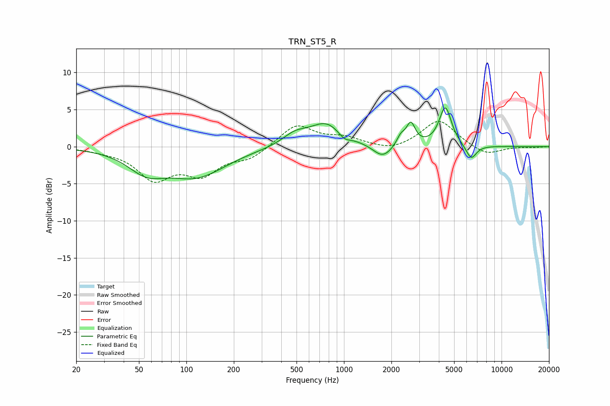

# TRN_ST5_R
See [usage instructions](https://github.com/jaakkopasanen/AutoEq#usage) for more options and info.

### Parametric EQs
Apply preamp of -5.3 dB when using parametric equalizer.

|   # | Type    |   Fc (Hz) |    Q |   Gain (dB) |
|-----|---------|-----------|------|-------------|
|   1 | Peaking |        56 | 1.22 |        -2.6 |
|   2 | Peaking |       116 | 0.75 |        -3.8 |
|   3 | Peaking |       487 | 1.77 |         1.4 |
|   4 | Peaking |       777 | 1.31 |         3.1 |
|   5 | Peaking |      1003 | 3.48 |        -0.9 |
|   6 | Peaking |      1762 | 2.32 |        -1.8 |
|   7 | Peaking |      2296 | 5.22 |         1.3 |
|   8 | Peaking |      2656 | 5.06 |         2.8 |
|   9 | Peaking |      4396 | 3.63 |         5.3 |
|  10 | Peaking |      6414 | 4.11 |        -2   |

### Fixed Band EQs
When using fixed band (also called graphic) equalizer, apply preamp of **-3.5 dB** (if available) and set gains manually with these parameters.

|   # | Type    |   Fc (Hz) |    Q |   Gain (dB) |
|-----|---------|-----------|------|-------------|
|   1 | Peaking |        31 | 1.41 |        -0.4 |
|   2 | Peaking |        62 | 1.41 |        -4.1 |
|   3 | Peaking |       125 | 1.41 |        -3.3 |
|   4 | Peaking |       250 | 1.41 |        -1.5 |
|   5 | Peaking |       500 | 1.41 |         3   |
|   6 | Peaking |      1000 | 1.41 |         1.1 |
|   7 | Peaking |      2000 | 1.41 |        -0.7 |
|   8 | Peaking |      4000 | 1.41 |         3.6 |
|   9 | Peaking |      8000 | 1.41 |        -1.2 |
|  10 | Peaking |     16000 | 1.41 |        -0.1 |

### Graphs

