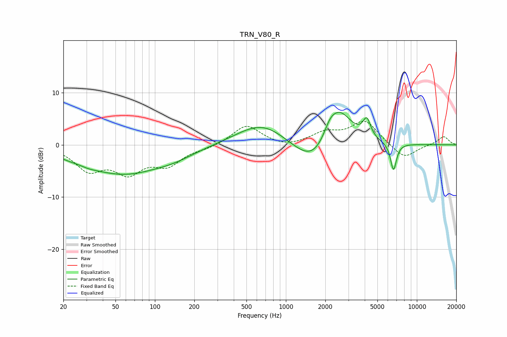

# TRN_V80_R
See [usage instructions](https://github.com/jaakkopasanen/AutoEq#usage) for more options and info.

### Parametric EQs
Apply preamp of -6.3 dB when using parametric equalizer.

|   # | Type    |   Fc (Hz) |    Q |   Gain (dB) |
|-----|---------|-----------|------|-------------|
|   1 | Peaking |        22 | 2.41 |        -0.3 |
|   2 | Peaking |        31 | 2.03 |        -0.4 |
|   3 | Peaking |        56 | 0.47 |        -5.4 |
|   4 | Peaking |       141 | 0.89 |        -1.1 |
|   5 | Peaking |       661 | 0.73 |         4.4 |
|   6 | Peaking |      1638 | 0.93 |        -5.6 |
|   7 | Peaking |      2167 | 2.97 |         2.2 |
|   8 | Peaking |      2564 | 1.37 |         7.6 |
|   9 | Peaking |      4147 | 4.75 |         3.5 |
|  10 | Peaking |      6632 | 6    |        -5.3 |

### Fixed Band EQs
When using fixed band (also called graphic) equalizer, apply preamp of **-4.6 dB** (if available) and set gains manually with these parameters.

|   # | Type    |   Fc (Hz) |    Q |   Gain (dB) |
|-----|---------|-----------|------|-------------|
|   1 | Peaking |        31 | 1.41 |        -4.4 |
|   2 | Peaking |        62 | 1.41 |        -4.7 |
|   3 | Peaking |       125 | 1.41 |        -3.4 |
|   4 | Peaking |       250 | 1.41 |        -0.6 |
|   5 | Peaking |       500 | 1.41 |         3.8 |
|   6 | Peaking |      1000 | 1.41 |        -0.6 |
|   7 | Peaking |      2000 | 1.41 |         2.1 |
|   8 | Peaking |      4000 | 1.41 |         4.5 |
|   9 | Peaking |      8000 | 1.41 |        -2.8 |
|  10 | Peaking |     16000 | 1.41 |         1.6 |

### Graphs

