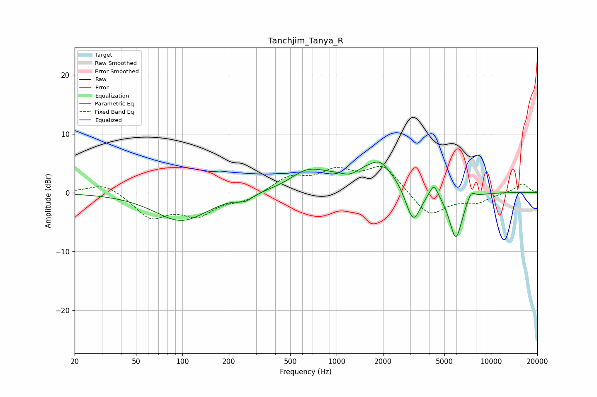

# Tanchjim_Tanya_R
See [usage instructions](https://github.com/jaakkopasanen/AutoEq#usage) for more options and info.

### Parametric EQs
Apply preamp of -5.3 dB when using parametric equalizer.

|   # | Type    |   Fc (Hz) |    Q |   Gain (dB) |
|-----|---------|-----------|------|-------------|
|   1 | Peaking |        98 | 0.82 |        -4.8 |
|   2 | Peaking |       255 | 3.08 |        -1   |
|   3 | Peaking |       640 | 1.33 |         2.5 |
|   4 | Peaking |      1228 | 2.11 |        -1.7 |
|   5 | Peaking |      1692 | 0.61 |         5.2 |
|   6 | Peaking |      1909 | 3.12 |         1.1 |
|   7 | Peaking |      3129 | 2.65 |        -7.1 |
|   8 | Peaking |      4268 | 5.21 |         2.2 |
|   9 | Peaking |      5924 | 3.11 |        -8.4 |
|  10 | Peaking |      7435 | 5.11 |         1.6 |

### Fixed Band EQs
When using fixed band (also called graphic) equalizer, apply preamp of **-4.5 dB** (if available) and set gains manually with these parameters.

|   # | Type    |   Fc (Hz) |    Q |   Gain (dB) |
|-----|---------|-----------|------|-------------|
|   1 | Peaking |        31 | 1.41 |         1.8 |
|   2 | Peaking |        62 | 1.41 |        -4.1 |
|   3 | Peaking |       125 | 1.41 |        -3.5 |
|   4 | Peaking |       250 | 1.41 |        -1.3 |
|   5 | Peaking |       500 | 1.41 |         2.5 |
|   6 | Peaking |      1000 | 1.41 |         3.2 |
|   7 | Peaking |      2000 | 1.41 |         4.5 |
|   8 | Peaking |      4000 | 1.41 |        -4.1 |
|   9 | Peaking |      8000 | 1.41 |        -1.5 |
|  10 | Peaking |     16000 | 1.41 |         1.6 |

### Graphs

