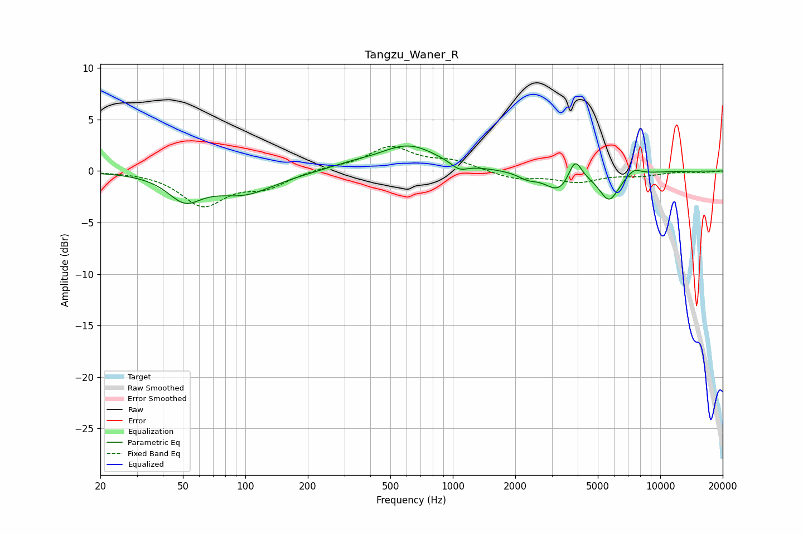

# Tangzu_Waner_R
See [usage instructions](https://github.com/jaakkopasanen/AutoEq#usage) for more options and info.

### Parametric EQs
Apply preamp of -2.5 dB when using parametric equalizer.

|   # | Type    |   Fc (Hz) |    Q |   Gain (dB) |
|-----|---------|-----------|------|-------------|
|   1 | Peaking |        51 | 1.75 |        -2.4 |
|   2 | Peaking |        98 | 0.94 |        -2.1 |
|   3 | Peaking |       320 | 1.27 |         0.4 |
|   4 | Peaking |       612 | 1    |         2.5 |
|   5 | Peaking |      1074 | 3.51 |        -0.7 |
|   6 | Peaking |      2289 | 3.16 |        -0.6 |
|   7 | Peaking |      3254 | 2.16 |        -2   |
|   8 | Peaking |      3880 | 4.45 |         2.3 |
|   9 | Peaking |      5670 | 2.9  |        -2.7 |
|  10 | Peaking |      7470 | 3.95 |         0.7 |

### Fixed Band EQs
When using fixed band (also called graphic) equalizer, apply preamp of **-2.5 dB** (if available) and set gains manually with these parameters.

|   # | Type    |   Fc (Hz) |    Q |   Gain (dB) |
|-----|---------|-----------|------|-------------|
|   1 | Peaking |        31 | 1.41 |         0   |
|   2 | Peaking |        62 | 1.41 |        -3.2 |
|   3 | Peaking |       125 | 1.41 |        -1.4 |
|   4 | Peaking |       250 | 1.41 |         0.3 |
|   5 | Peaking |       500 | 1.41 |         2.3 |
|   6 | Peaking |      1000 | 1.41 |         0.9 |
|   7 | Peaking |      2000 | 1.41 |        -0.8 |
|   8 | Peaking |      4000 | 1.41 |        -1   |
|   9 | Peaking |      8000 | 1.41 |        -0.4 |
|  10 | Peaking |     16000 | 1.41 |        -0.1 |

### Graphs

