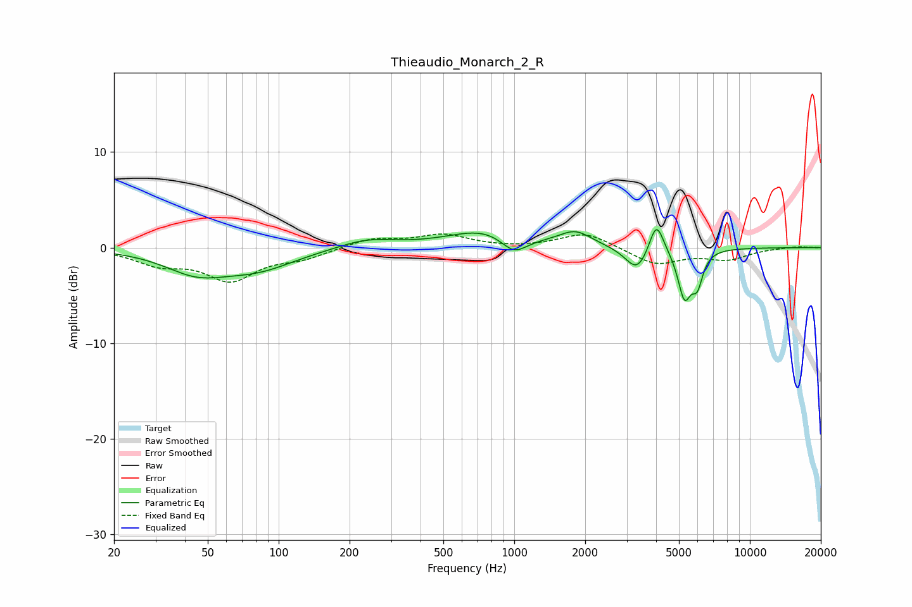

# Thieaudio_Monarch_2_R
See [usage instructions](https://github.com/jaakkopasanen/AutoEq#usage) for more options and info.

### Parametric EQs
Apply preamp of -2.0 dB when using parametric equalizer.

|   # | Type    |   Fc (Hz) |    Q |   Gain (dB) |
|-----|---------|-----------|------|-------------|
|   1 | Peaking |        45 | 1.05 |        -2.3 |
|   2 | Peaking |        82 | 0.89 |        -1.9 |
|   3 | Peaking |       236 | 1.18 |         0.9 |
|   4 | Peaking |       761 | 0.92 |         1.9 |
|   5 | Peaking |       997 | 2.48 |        -1.9 |
|   6 | Peaking |      1818 | 2.03 |         1.5 |
|   7 | Peaking |      3327 | 2.87 |        -2.6 |
|   8 | Peaking |      4009 | 4.6  |         3.5 |
|   9 | Peaking |      5279 | 4.93 |        -4.9 |
|  10 | Peaking |      5984 | 5.97 |        -3   |

### Fixed Band EQs
When using fixed band (also called graphic) equalizer, apply preamp of **-1.5 dB** (if available) and set gains manually with these parameters.

|   # | Type    |   Fc (Hz) |    Q |   Gain (dB) |
|-----|---------|-----------|------|-------------|
|   1 | Peaking |        31 | 1.41 |        -1.5 |
|   2 | Peaking |        62 | 1.41 |        -3.2 |
|   3 | Peaking |       125 | 1.41 |        -1   |
|   4 | Peaking |       250 | 1.41 |         0.9 |
|   5 | Peaking |       500 | 1.41 |         1.3 |
|   6 | Peaking |      1000 | 1.41 |        -0.1 |
|   7 | Peaking |      2000 | 1.41 |         1.6 |
|   8 | Peaking |      4000 | 1.41 |        -1.8 |
|   9 | Peaking |      8000 | 1.41 |        -1.1 |
|  10 | Peaking |     16000 | 1.41 |         0.1 |

### Graphs

