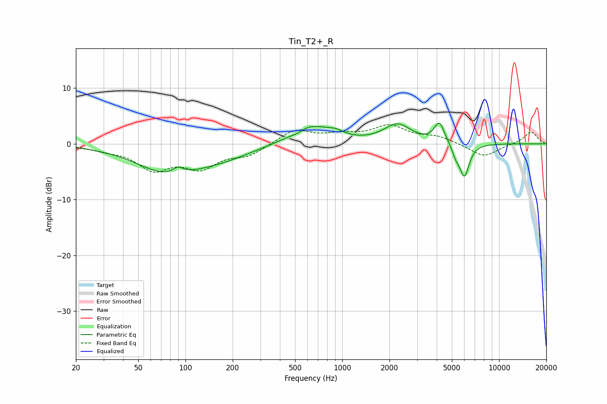

# Tin_T2+_R
See [usage instructions](https://github.com/jaakkopasanen/AutoEq#usage) for more options and info.

### Parametric EQs
Apply preamp of -3.8 dB when using parametric equalizer.

|   # | Type    |   Fc (Hz) |    Q |   Gain (dB) |
|-----|---------|-----------|------|-------------|
|   1 | Peaking |        79 | 0.7  |        -5.1 |
|   2 | Peaking |        89 | 3.82 |         1.4 |
|   3 | Peaking |       179 | 0.77 |        -1.6 |
|   4 | Peaking |       513 | 3.69 |        -0.5 |
|   5 | Peaking |       622 | 1.15 |         3.3 |
|   6 | Peaking |       905 | 2.66 |         0.8 |
|   7 | Peaking |      2249 | 1.64 |         3.3 |
|   8 | Peaking |      4162 | 4.34 |         3.7 |
|   9 | Peaking |      5298 | 5.98 |        -1.6 |
|  10 | Peaking |      6006 | 4.44 |        -5.9 |

### Fixed Band EQs
When using fixed band (also called graphic) equalizer, apply preamp of **-3.5 dB** (if available) and set gains manually with these parameters.

|   # | Type    |   Fc (Hz) |    Q |   Gain (dB) |
|-----|---------|-----------|------|-------------|
|   1 | Peaking |        31 | 1.41 |        -0.8 |
|   2 | Peaking |        62 | 1.41 |        -4.2 |
|   3 | Peaking |       125 | 1.41 |        -3.8 |
|   4 | Peaking |       250 | 1.41 |        -1.9 |
|   5 | Peaking |       500 | 1.41 |         2.5 |
|   6 | Peaking |      1000 | 1.41 |         1.3 |
|   7 | Peaking |      2000 | 1.41 |         3   |
|   8 | Peaking |      4000 | 1.41 |         1.2 |
|   9 | Peaking |      8000 | 1.41 |        -2.4 |
|  10 | Peaking |     16000 | 1.41 |         2.2 |

### Graphs

