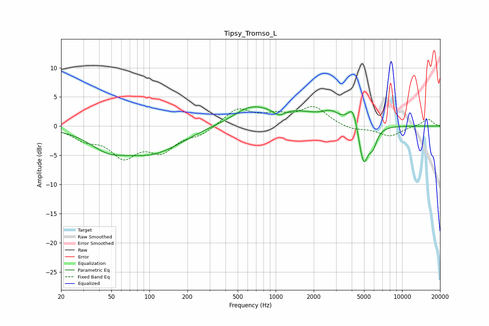

# Tipsy_Tromso_L
See [usage instructions](https://github.com/jaakkopasanen/AutoEq#usage) for more options and info.

### Parametric EQs
Apply preamp of -3.4 dB when using parametric equalizer.

|   # | Type    |   Fc (Hz) |    Q |   Gain (dB) |
|-----|---------|-----------|------|-------------|
|   1 | Peaking |        48 | 0.91 |        -3.4 |
|   2 | Peaking |        91 | 0.91 |        -1.7 |
|   3 | Peaking |       133 | 0.68 |        -2.7 |
|   4 | Peaking |       613 | 1.3  |         1.4 |
|   5 | Peaking |      1064 | 2.83 |        -1.4 |
|   6 | Peaking |      1082 | 0.49 |         3   |
|   7 | Peaking |      2742 | 2.2  |         1.3 |
|   8 | Peaking |      4079 | 3.81 |         3.4 |
|   9 | Peaking |      4952 | 3.74 |        -6.9 |
|  10 | Peaking |      5880 | 4.28 |        -2.6 |

### Fixed Band EQs
When using fixed band (also called graphic) equalizer, apply preamp of **-3.5 dB** (if available) and set gains manually with these parameters.

|   # | Type    |   Fc (Hz) |    Q |   Gain (dB) |
|-----|---------|-----------|------|-------------|
|   1 | Peaking |        31 | 1.41 |        -1.9 |
|   2 | Peaking |        62 | 1.41 |        -4.7 |
|   3 | Peaking |       125 | 1.41 |        -3.8 |
|   4 | Peaking |       250 | 1.41 |        -1.3 |
|   5 | Peaking |       500 | 1.41 |         3   |
|   6 | Peaking |      1000 | 1.41 |         1.5 |
|   7 | Peaking |      2000 | 1.41 |         3.1 |
|   8 | Peaking |      4000 | 1.41 |        -0.7 |
|   9 | Peaking |      8000 | 1.41 |        -1.7 |
|  10 | Peaking |     16000 | 1.41 |         1.3 |

### Graphs

