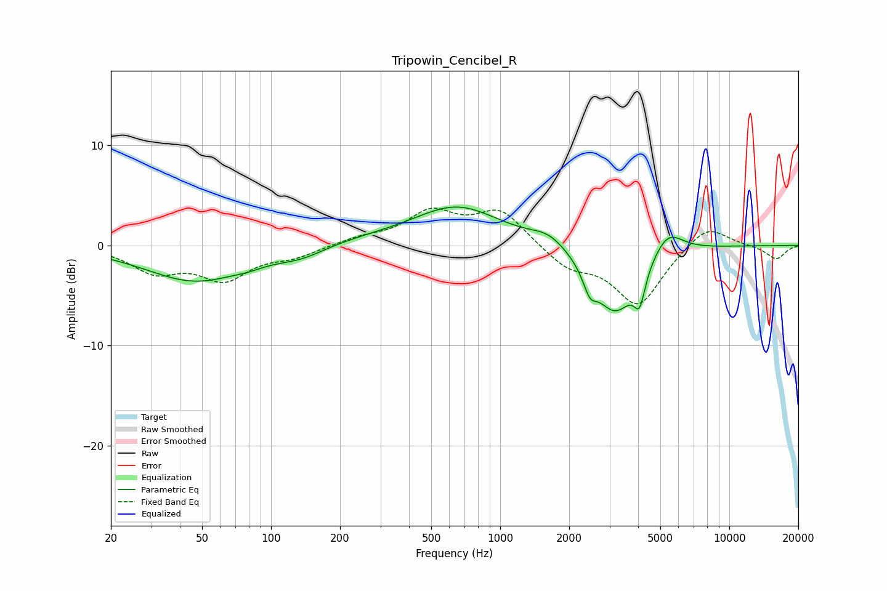

# Tripowin_Cencibel_R
See [usage instructions](https://github.com/jaakkopasanen/AutoEq#usage) for more options and info.

### Parametric EQs
Apply preamp of -3.9 dB when using parametric equalizer.

|   # | Type    |   Fc (Hz) |    Q |   Gain (dB) |
|-----|---------|-----------|------|-------------|
|   1 | Peaking |        47 | 0.64 |        -3.6 |
|   2 | Peaking |        80 | 2.26 |        -0.3 |
|   3 | Peaking |       136 | 1.26 |        -1.1 |
|   4 | Peaking |       219 | 0.54 |         0.5 |
|   5 | Peaking |       651 | 0.75 |         3.8 |
|   6 | Peaking |      1629 | 1.84 |         1.2 |
|   7 | Peaking |      2462 | 4.97 |        -2   |
|   8 | Peaking |      3171 | 1.46 |        -6.8 |
|   9 | Peaking |      4058 | 5.91 |        -3.1 |
|  10 | Peaking |      5383 | 2.13 |         2.5 |

### Fixed Band EQs
When using fixed band (also called graphic) equalizer, apply preamp of **-3.8 dB** (if available) and set gains manually with these parameters.

|   # | Type    |   Fc (Hz) |    Q |   Gain (dB) |
|-----|---------|-----------|------|-------------|
|   1 | Peaking |        31 | 1.41 |        -2.4 |
|   2 | Peaking |        62 | 1.41 |        -3.1 |
|   3 | Peaking |       125 | 1.41 |        -1   |
|   4 | Peaking |       250 | 1.41 |         0.7 |
|   5 | Peaking |       500 | 1.41 |         3.1 |
|   6 | Peaking |      1000 | 1.41 |         3.4 |
|   7 | Peaking |      2000 | 1.41 |        -2.1 |
|   8 | Peaking |      4000 | 1.41 |        -5.9 |
|   9 | Peaking |      8000 | 1.41 |         2.3 |
|  10 | Peaking |     16000 | 1.41 |        -1.4 |

### Graphs

