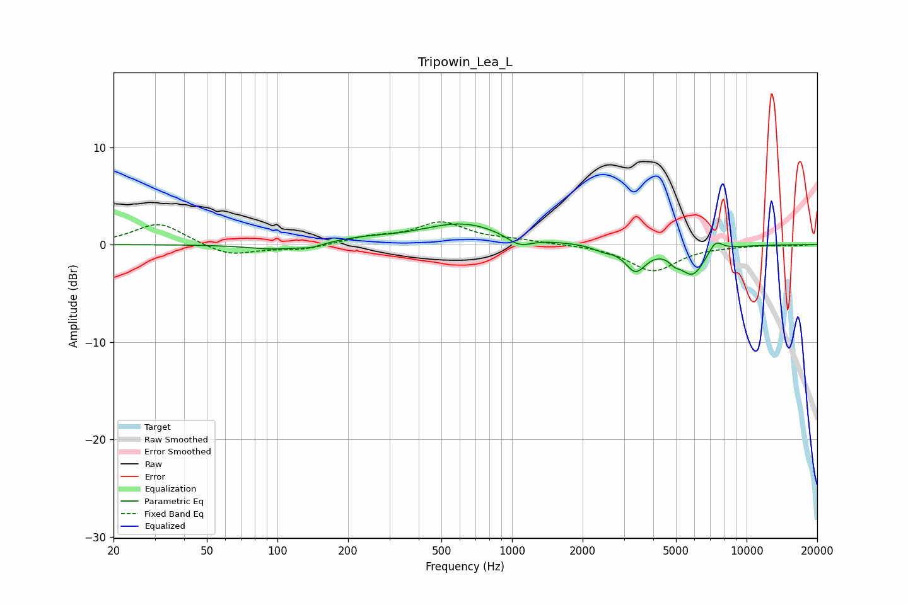

# Tripowin_Lea_L
See [usage instructions](https://github.com/jaakkopasanen/AutoEq#usage) for more options and info.

### Parametric EQs
Apply preamp of -2.2 dB when using parametric equalizer.

|   # | Type    |   Fc (Hz) |    Q |   Gain (dB) |
|-----|---------|-----------|------|-------------|
|   1 | Peaking |        98 | 1.21 |        -0.6 |
|   2 | Peaking |       139 | 3.18 |        -0.3 |
|   3 | Peaking |       230 | 1.1  |         0.5 |
|   4 | Peaking |       616 | 0.8  |         2.2 |
|   5 | Peaking |      1074 | 2.67 |        -1.1 |
|   6 | Peaking |      2443 | 3.34 |        -0.4 |
|   7 | Peaking |      3361 | 3.19 |        -2.5 |
|   8 | Peaking |      4934 | 6    |        -0.6 |
|   9 | Peaking |      5885 | 2.51 |        -3   |
|  10 | Peaking |      7362 | 4.44 |         1.2 |

### Fixed Band EQs
When using fixed band (also called graphic) equalizer, apply preamp of **-2.4 dB** (if available) and set gains manually with these parameters.

|   # | Type    |   Fc (Hz) |    Q |   Gain (dB) |
|-----|---------|-----------|------|-------------|
|   1 | Peaking |        31 | 1.41 |         2.3 |
|   2 | Peaking |        62 | 1.41 |        -1.2 |
|   3 | Peaking |       125 | 1.41 |        -0.5 |
|   4 | Peaking |       250 | 1.41 |         0.7 |
|   5 | Peaking |       500 | 1.41 |         2.2 |
|   6 | Peaking |      1000 | 1.41 |         0.4 |
|   7 | Peaking |      2000 | 1.41 |         0   |
|   8 | Peaking |      4000 | 1.41 |        -2.7 |
|   9 | Peaking |      8000 | 1.41 |        -0.1 |
|  10 | Peaking |     16000 | 1.41 |        -0.1 |

### Graphs

