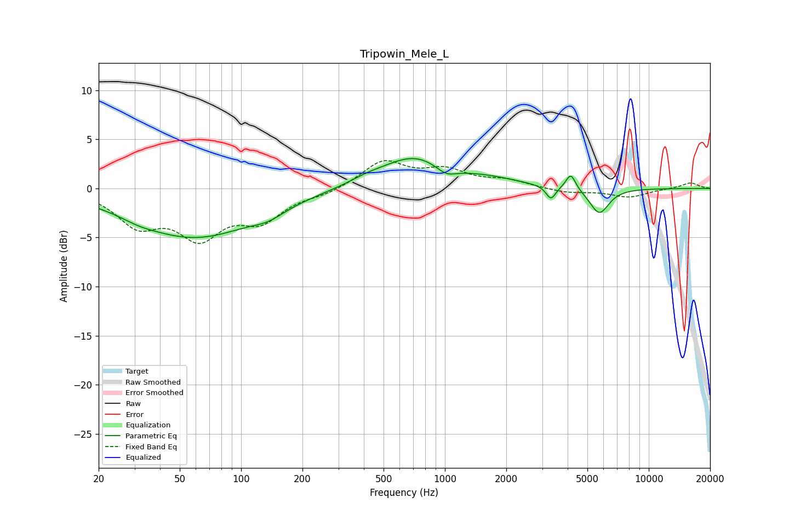

# Tripowin_Mele_L
See [usage instructions](https://github.com/jaakkopasanen/AutoEq#usage) for more options and info.

### Parametric EQs
Apply preamp of -3.1 dB when using parametric equalizer.

|   # | Type    |   Fc (Hz) |    Q |   Gain (dB) |
|-----|---------|-----------|------|-------------|
|   1 | Peaking |        32 | 1.77 |        -0.3 |
|   2 | Peaking |        59 | 0.47 |        -4.9 |
|   3 | Peaking |       136 | 1.75 |        -0.8 |
|   4 | Peaking |       411 | 1.59 |         0.5 |
|   5 | Peaking |       705 | 0.87 |         3.1 |
|   6 | Peaking |      1014 | 2.77 |        -0.9 |
|   7 | Peaking |      1678 | 0.91 |         0.7 |
|   8 | Peaking |      3311 | 6    |        -1.4 |
|   9 | Peaking |      4146 | 5.91 |         1.7 |
|  10 | Peaking |      5720 | 2.94 |        -2.6 |

### Fixed Band EQs
When using fixed band (also called graphic) equalizer, apply preamp of **-2.9 dB** (if available) and set gains manually with these parameters.

|   # | Type    |   Fc (Hz) |    Q |   Gain (dB) |
|-----|---------|-----------|------|-------------|
|   1 | Peaking |        31 | 1.41 |        -3.4 |
|   2 | Peaking |        62 | 1.41 |        -4.5 |
|   3 | Peaking |       125 | 1.41 |        -2.9 |
|   4 | Peaking |       250 | 1.41 |        -0.5 |
|   5 | Peaking |       500 | 1.41 |         2.7 |
|   6 | Peaking |      1000 | 1.41 |         1.7 |
|   7 | Peaking |      2000 | 1.41 |         0.7 |
|   8 | Peaking |      4000 | 1.41 |        -0.4 |
|   9 | Peaking |      8000 | 1.41 |        -0.9 |
|  10 | Peaking |     16000 | 1.41 |         0.6 |

### Graphs

