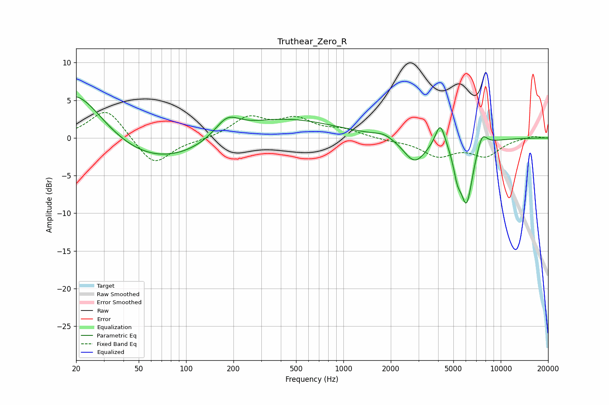

# Truthear_Zero_R
See [usage instructions](https://github.com/jaakkopasanen/AutoEq#usage) for more options and info.

### Parametric EQs
Apply preamp of -5.6 dB when using parametric equalizer.

|   # | Type    |   Fc (Hz) |    Q |   Gain (dB) |
|-----|---------|-----------|------|-------------|
|   1 | Peaking |        20 | 0.67 |         9.7 |
|   2 | Peaking |        51 | 0.24 |        -5.6 |
|   3 | Peaking |       182 | 1.82 |         2.5 |
|   4 | Peaking |       293 | 0.35 |         3.7 |
|   5 | Peaking |      1814 | 2.42 |         0.6 |
|   6 | Peaking |      2837 | 1.98 |        -3.3 |
|   7 | Peaking |      4130 | 4.48 |         3.3 |
|   8 | Peaking |      5294 | 5.73 |        -2.5 |
|   9 | Peaking |      6061 | 3.38 |        -8.4 |
|  10 | Peaking |      7600 | 4.15 |         2.1 |

### Fixed Band EQs
When using fixed band (also called graphic) equalizer, apply preamp of **-3.5 dB** (if available) and set gains manually with these parameters.

|   # | Type    |   Fc (Hz) |    Q |   Gain (dB) |
|-----|---------|-----------|------|-------------|
|   1 | Peaking |        31 | 1.41 |         4   |
|   2 | Peaking |        62 | 1.41 |        -3.8 |
|   3 | Peaking |       125 | 1.41 |        -0.2 |
|   4 | Peaking |       250 | 1.41 |         2.6 |
|   5 | Peaking |       500 | 1.41 |         2.3 |
|   6 | Peaking |      1000 | 1.41 |         1   |
|   7 | Peaking |      2000 | 1.41 |        -0.3 |
|   8 | Peaking |      4000 | 1.41 |        -2.3 |
|   9 | Peaking |      8000 | 1.41 |        -2.2 |
|  10 | Peaking |     16000 | 1.41 |         0.3 |

### Graphs

