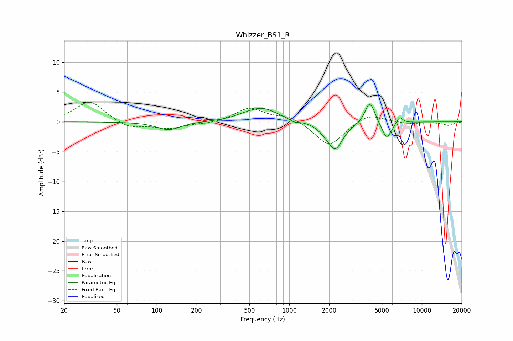

# Whizzer_BS1_R
See [usage instructions](https://github.com/jaakkopasanen/AutoEq#usage) for more options and info.

### Parametric EQs
Apply preamp of -3.0 dB when using parametric equalizer.

|   # | Type    |   Fc (Hz) |    Q |   Gain (dB) |
|-----|---------|-----------|------|-------------|
|   1 | Peaking |       123 | 1.62 |        -1.4 |
|   2 | Peaking |       439 | 2.17 |         0.2 |
|   3 | Peaking |       620 | 1.21 |         2.3 |
|   4 | Peaking |      1088 | 4.19 |        -0.5 |
|   5 | Peaking |      1792 | 3.41 |        -0.4 |
|   6 | Peaking |      2215 | 2.46 |        -4.6 |
|   7 | Peaking |      3996 | 4.2  |         3.2 |
|   8 | Peaking |      4308 | 6    |         0.8 |
|   9 | Peaking |      5446 | 3.96 |        -2.8 |
|  10 | Peaking |      6804 | 6    |         1.2 |

### Fixed Band EQs
When using fixed band (also called graphic) equalizer, apply preamp of **-3.4 dB** (if available) and set gains manually with these parameters.

|   # | Type    |   Fc (Hz) |    Q |   Gain (dB) |
|-----|---------|-----------|------|-------------|
|   1 | Peaking |        31 | 1.41 |         3.5 |
|   2 | Peaking |        62 | 1.41 |        -1.2 |
|   3 | Peaking |       125 | 1.41 |        -1.1 |
|   4 | Peaking |       250 | 1.41 |        -0.3 |
|   5 | Peaking |       500 | 1.41 |         2.3 |
|   6 | Peaking |      1000 | 1.41 |         1   |
|   7 | Peaking |      2000 | 1.41 |        -4.2 |
|   8 | Peaking |      4000 | 1.41 |         1.5 |
|   9 | Peaking |      8000 | 1.41 |        -0.3 |
|  10 | Peaking |     16000 | 1.41 |        -0.6 |

### Graphs

