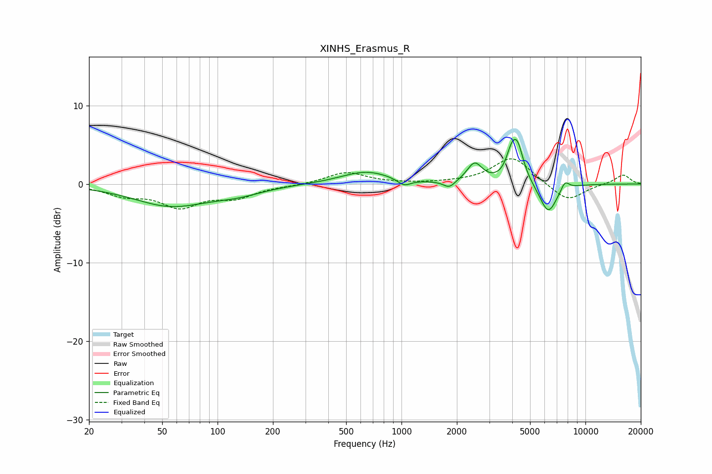

# XINHS_Erasmus_R
See [usage instructions](https://github.com/jaakkopasanen/AutoEq#usage) for more options and info.

### Parametric EQs
Apply preamp of -5.8 dB when using parametric equalizer.

|   # | Type    |   Fc (Hz) |    Q |   Gain (dB) |
|-----|---------|-----------|------|-------------|
|   1 | Peaking |        55 | 0.7  |        -2.7 |
|   2 | Peaking |       129 | 0.99 |        -0.9 |
|   3 | Peaking |       642 | 1.04 |         1.6 |
|   4 | Peaking |      1034 | 3.85 |        -0.9 |
|   5 | Peaking |      1819 | 4.51 |        -0.9 |
|   6 | Peaking |      2499 | 3.43 |         2.5 |
|   7 | Peaking |      3933 | 5.3  |         1.9 |
|   8 | Peaking |      4251 | 4    |         4.8 |
|   9 | Peaking |      6281 | 2.89 |        -3.9 |
|  10 | Peaking |      7741 | 5.95 |         1.2 |

### Fixed Band EQs
When using fixed band (also called graphic) equalizer, apply preamp of **-3.3 dB** (if available) and set gains manually with these parameters.

|   # | Type    |   Fc (Hz) |    Q |   Gain (dB) |
|-----|---------|-----------|------|-------------|
|   1 | Peaking |        31 | 1.41 |        -1.3 |
|   2 | Peaking |        62 | 1.41 |        -2.7 |
|   3 | Peaking |       125 | 1.41 |        -1.5 |
|   4 | Peaking |       250 | 1.41 |        -0.2 |
|   5 | Peaking |       500 | 1.41 |         1.5 |
|   6 | Peaking |      1000 | 1.41 |         0   |
|   7 | Peaking |      2000 | 1.41 |         0.1 |
|   8 | Peaking |      4000 | 1.41 |         3.5 |
|   9 | Peaking |      8000 | 1.41 |        -2.3 |
|  10 | Peaking |     16000 | 1.41 |         1.2 |

### Graphs

