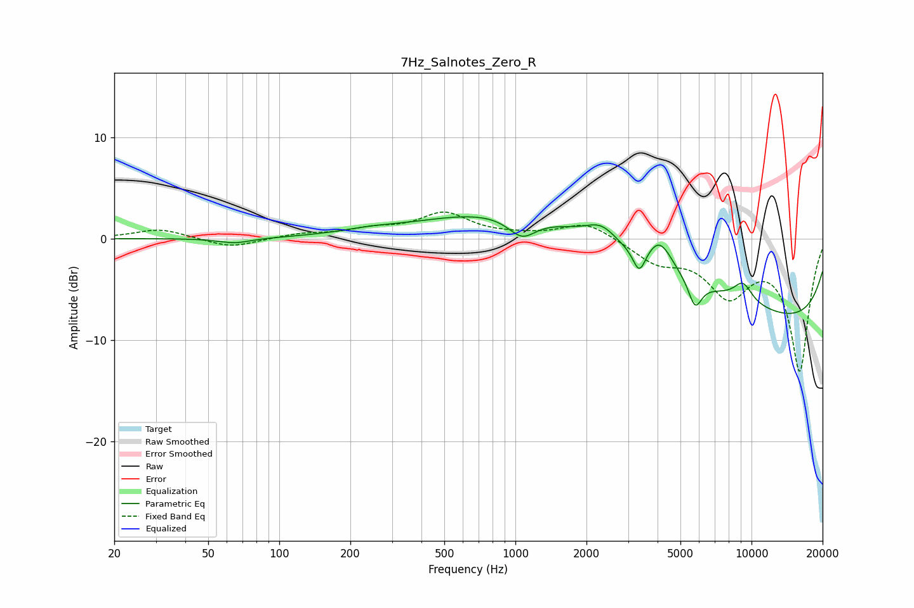

# 7Hz_Salnotes_Zero_R
See [usage instructions](https://github.com/jaakkopasanen/AutoEq#usage) for more options and info.

### Parametric EQs
Apply preamp of -2.2 dB when using parametric equalizer.

|   # | Type    |   Fc (Hz) |    Q |   Gain (dB) |
|-----|---------|-----------|------|-------------|
|   1 | Peaking |        65 | 2.04 |        -0.5 |
|   2 | Peaking |       238 | 1.15 |         0.4 |
|   3 | Peaking |      1067 | 2.35 |        -2.1 |
|   4 | Peaking |      2312 | 2.16 |         1.6 |
|   5 | Peaking |      2527 | 0.18 |         4.7 |
|   6 | Peaking |      3348 | 5.37 |        -2.4 |
|   7 | Peaking |      4090 | 2.64 |         2.8 |
|   8 | Peaking |      5766 | 4.88 |        -2.7 |
|   9 | Peaking |      9196 | 3.17 |         1.9 |
|  10 | Peaking |     10000 | 0.18 |        -9.4 |

### Fixed Band EQs
When using fixed band (also called graphic) equalizer, apply preamp of **-2.7 dB** (if available) and set gains manually with these parameters.

|   # | Type    |   Fc (Hz) |    Q |   Gain (dB) |
|-----|---------|-----------|------|-------------|
|   1 | Peaking |        31 | 1.41 |         1   |
|   2 | Peaking |        62 | 1.41 |        -0.9 |
|   3 | Peaking |       125 | 1.41 |         0.4 |
|   4 | Peaking |       250 | 1.41 |         0.8 |
|   5 | Peaking |       500 | 1.41 |         2.4 |
|   6 | Peaking |      1000 | 1.41 |         0.2 |
|   7 | Peaking |      2000 | 1.41 |         1.7 |
|   8 | Peaking |      4000 | 1.41 |        -2.1 |
|   9 | Peaking |      8000 | 1.41 |        -5   |
|  10 | Peaking |     16000 | 1.41 |       -12.9 |

### Graphs

