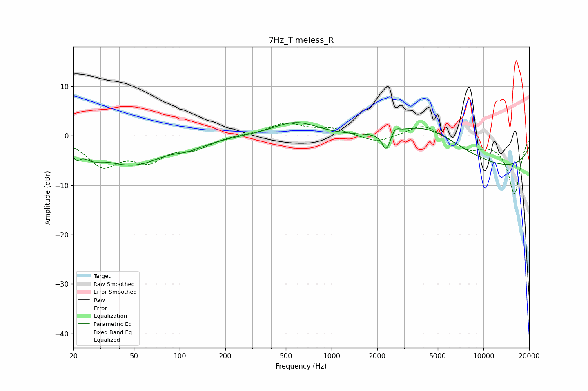

# 7Hz_Timeless_R
See [usage instructions](https://github.com/jaakkopasanen/AutoEq#usage) for more options and info.

### Parametric EQs
Apply preamp of -2.8 dB when using parametric equalizer.

|   # | Type    |   Fc (Hz) |    Q |   Gain (dB) |
|-----|---------|-----------|------|-------------|
|   1 | Peaking |        21 | 5.72 |        -2   |
|   2 | Peaking |        27 | 2.39 |        -1.6 |
|   3 | Peaking |        49 | 0.65 |        -5.7 |
|   4 | Peaking |        91 | 1.37 |         1   |
|   5 | Peaking |       107 | 1.2  |        -1.8 |
|   6 | Peaking |       581 | 0.96 |         2.9 |
|   7 | Peaking |      2293 | 5.26 |        -3.8 |
|   8 | Peaking |      2624 | 5.73 |         1.2 |
|   9 | Peaking |      4138 | 0.56 |         7.4 |
|  10 | Peaking |      9584 | 0.18 |        -7.2 |

### Fixed Band EQs
When using fixed band (also called graphic) equalizer, apply preamp of **-2.7 dB** (if available) and set gains manually with these parameters.

|   # | Type    |   Fc (Hz) |    Q |   Gain (dB) |
|-----|---------|-----------|------|-------------|
|   1 | Peaking |        31 | 1.41 |        -5.7 |
|   2 | Peaking |        62 | 1.41 |        -4.3 |
|   3 | Peaking |       125 | 1.41 |        -2.2 |
|   4 | Peaking |       250 | 1.41 |         0.2 |
|   5 | Peaking |       500 | 1.41 |         2.5 |
|   6 | Peaking |      1000 | 1.41 |         1.4 |
|   7 | Peaking |      2000 | 1.41 |        -1.5 |
|   8 | Peaking |      4000 | 1.41 |         2.5 |
|   9 | Peaking |      8000 | 1.41 |        -2.5 |
|  10 | Peaking |     16000 | 1.41 |       -11.7 |

### Graphs

