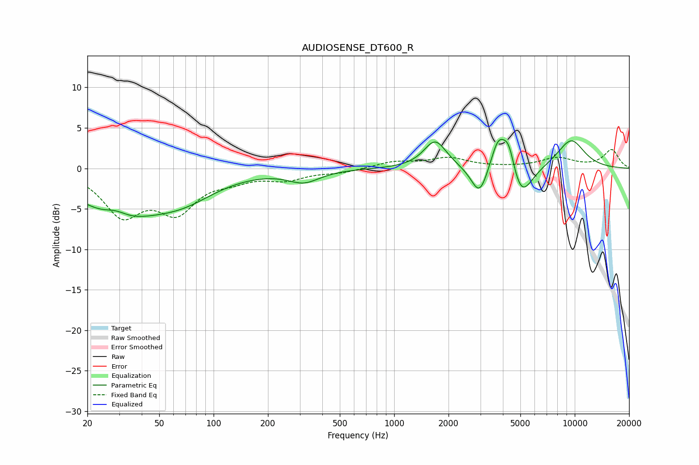

# AUDIOSENSE_DT600_R
See [usage instructions](https://github.com/jaakkopasanen/AutoEq#usage) for more options and info.

### Parametric EQs
Apply preamp of -3.7 dB when using parametric equalizer.

|   # | Type    |   Fc (Hz) |    Q |   Gain (dB) |
|-----|---------|-----------|------|-------------|
|   1 | Peaking |        29 | 2.15 |         1.1 |
|   2 | Peaking |        29 | 0.64 |        -5.4 |
|   3 | Peaking |        67 | 0.76 |        -2.8 |
|   4 | Peaking |       316 | 1.61 |        -1.5 |
|   5 | Peaking |      1688 | 2.25 |         3.5 |
|   6 | Peaking |      2970 | 3.08 |        -3.8 |
|   7 | Peaking |      3773 | 3.32 |         4   |
|   8 | Peaking |      4316 | 4.13 |         3.5 |
|   9 | Peaking |      5036 | 2.29 |        -4.3 |
|  10 | Peaking |      9538 | 1.59 |         3.6 |

### Fixed Band EQs
When using fixed band (also called graphic) equalizer, apply preamp of **-2.4 dB** (if available) and set gains manually with these parameters.

|   # | Type    |   Fc (Hz) |    Q |   Gain (dB) |
|-----|---------|-----------|------|-------------|
|   1 | Peaking |        31 | 1.41 |        -5.4 |
|   2 | Peaking |        62 | 1.41 |        -4.8 |
|   3 | Peaking |       125 | 1.41 |        -1   |
|   4 | Peaking |       250 | 1.41 |        -1.2 |
|   5 | Peaking |       500 | 1.41 |        -0.5 |
|   6 | Peaking |      1000 | 1.41 |         0.8 |
|   7 | Peaking |      2000 | 1.41 |         1.2 |
|   8 | Peaking |      4000 | 1.41 |         0.1 |
|   9 | Peaking |      8000 | 1.41 |         1.2 |
|  10 | Peaking |     16000 | 1.41 |         2.3 |

### Graphs

