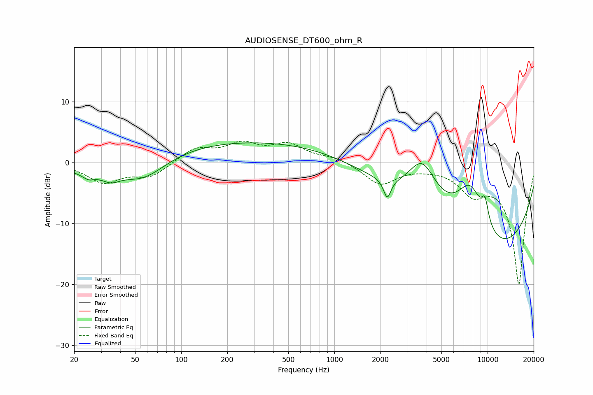

# AUDIOSENSE_DT600_ohm_R
See [usage instructions](https://github.com/jaakkopasanen/AutoEq#usage) for more options and info.

### Parametric EQs
Apply preamp of -3.4 dB when using parametric equalizer.

|   # | Type    |   Fc (Hz) |    Q |   Gain (dB) |
|-----|---------|-----------|------|-------------|
|   1 | Peaking |        24 | 1.45 |        -1.5 |
|   2 | Peaking |        25 | 5.34 |        -0.5 |
|   3 | Peaking |        35 | 2.4  |        -1.5 |
|   4 | Peaking |        56 | 0.92 |        -3.8 |
|   5 | Peaking |       328 | 0.18 |         3.7 |
|   6 | Peaking |      2214 | 6    |        -3.2 |
|   7 | Peaking |      3740 | 1.4  |         8   |
|   8 | Peaking |      7718 | 1.22 |        10.8 |
|   9 | Peaking |      9516 | 0.25 |       -16.8 |
|  10 | Peaking |      9615 | 5.56 |         3.5 |

### Fixed Band EQs
When using fixed band (also called graphic) equalizer, apply preamp of **-3.7 dB** (if available) and set gains manually with these parameters.

|   # | Type    |   Fc (Hz) |    Q |   Gain (dB) |
|-----|---------|-----------|------|-------------|
|   1 | Peaking |        31 | 1.41 |        -3.1 |
|   2 | Peaking |        62 | 1.41 |        -2.2 |
|   3 | Peaking |       125 | 1.41 |         2.3 |
|   4 | Peaking |       250 | 1.41 |         2.7 |
|   5 | Peaking |       500 | 1.41 |         2.7 |
|   6 | Peaking |      1000 | 1.41 |         0.8 |
|   7 | Peaking |      2000 | 1.41 |        -3.5 |
|   8 | Peaking |      4000 | 1.41 |        -0.3 |
|   9 | Peaking |      8000 | 1.41 |        -4   |
|  10 | Peaking |     16000 | 1.41 |       -20   |

### Graphs

