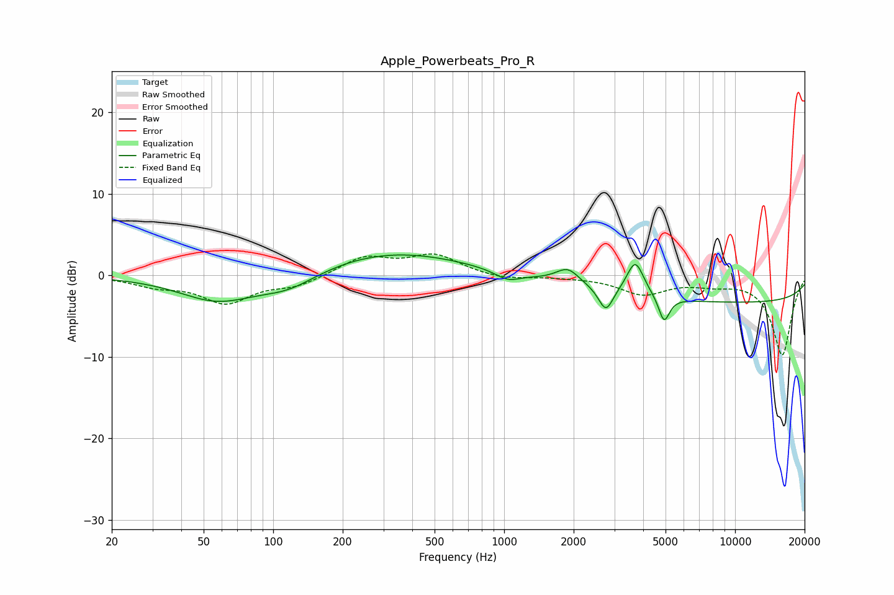

# Apple_Powerbeats_Pro_R
See [usage instructions](https://github.com/jaakkopasanen/AutoEq#usage) for more options and info.

### Parametric EQs
Apply preamp of -2.6 dB when using parametric equalizer.

|   # | Type    |   Fc (Hz) |    Q |   Gain (dB) |
|-----|---------|-----------|------|-------------|
|   1 | Peaking |        57 | 0.85 |        -3.1 |
|   2 | Peaking |       117 | 1.1  |        -1.9 |
|   3 | Peaking |       326 | 0.44 |         2.9 |
|   4 | Peaking |       439 | 1.22 |        -0   |
|   5 | Peaking |      1037 | 2.57 |        -1.1 |
|   6 | Peaking |      1888 | 2.77 |         1.9 |
|   7 | Peaking |      2758 | 4.54 |        -3   |
|   8 | Peaking |      3699 | 3.79 |         4.3 |
|   9 | Peaking |      4927 | 5.99 |        -3.2 |
|  10 | Peaking |     10000 | 0.18 |        -3.3 |

### Fixed Band EQs
When using fixed band (also called graphic) equalizer, apply preamp of **-2.7 dB** (if available) and set gains manually with these parameters.

|   # | Type    |   Fc (Hz) |    Q |   Gain (dB) |
|-----|---------|-----------|------|-------------|
|   1 | Peaking |        31 | 1.41 |        -1.1 |
|   2 | Peaking |        62 | 1.41 |        -3.2 |
|   3 | Peaking |       125 | 1.41 |        -1.2 |
|   4 | Peaking |       250 | 1.41 |         2.2 |
|   5 | Peaking |       500 | 1.41 |         2.4 |
|   6 | Peaking |      1000 | 1.41 |        -0.6 |
|   7 | Peaking |      2000 | 1.41 |        -0.1 |
|   8 | Peaking |      4000 | 1.41 |        -2.2 |
|   9 | Peaking |      8000 | 1.41 |        -0.8 |
|  10 | Peaking |     16000 | 1.41 |        -9.8 |

### Graphs

