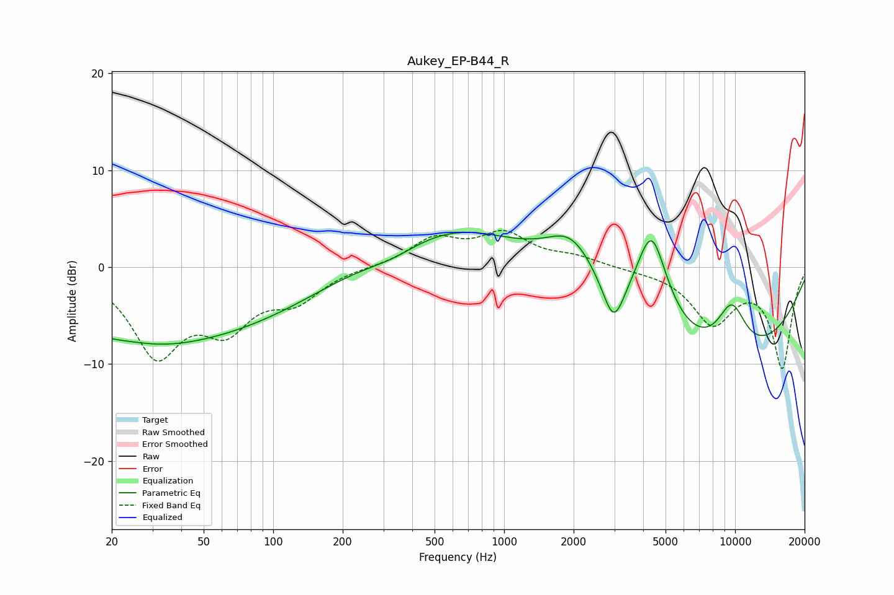

# Aukey_EP-B44_R
See [usage instructions](https://github.com/jaakkopasanen/AutoEq#usage) for more options and info.

### Parametric EQs
Apply preamp of -3.7 dB when using parametric equalizer.

|   # | Type    |   Fc (Hz) |    Q |   Gain (dB) |
|-----|---------|-----------|------|-------------|
|   1 | Peaking |        21 | 0.73 |        -6.1 |
|   2 | Peaking |        23 | 0.94 |         3.8 |
|   3 | Peaking |        48 | 0.28 |        -6.5 |
|   4 | Peaking |       331 | 1.05 |        -1.5 |
|   5 | Peaking |       551 | 0.41 |         4.8 |
|   6 | Peaking |      1960 | 1.25 |         4.8 |
|   7 | Peaking |      2980 | 3.04 |        -4.7 |
|   8 | Peaking |      4352 | 1.95 |         9.9 |
|   9 | Peaking |      8421 | 0.28 |       -10   |
|  10 | Peaking |      9665 | 1.91 |         5.2 |

### Fixed Band EQs
When using fixed band (also called graphic) equalizer, apply preamp of **-3.9 dB** (if available) and set gains manually with these parameters.

|   # | Type    |   Fc (Hz) |    Q |   Gain (dB) |
|-----|---------|-----------|------|-------------|
|   1 | Peaking |        31 | 1.41 |        -8.6 |
|   2 | Peaking |        62 | 1.41 |        -5.3 |
|   3 | Peaking |       125 | 1.41 |        -3   |
|   4 | Peaking |       250 | 1.41 |         0   |
|   5 | Peaking |       500 | 1.41 |         2.8 |
|   6 | Peaking |      1000 | 1.41 |         3.2 |
|   7 | Peaking |      2000 | 1.41 |         0.9 |
|   8 | Peaking |      4000 | 1.41 |        -0.2 |
|   9 | Peaking |      8000 | 1.41 |        -5.5 |
|  10 | Peaking |     16000 | 1.41 |       -10.2 |

### Graphs

