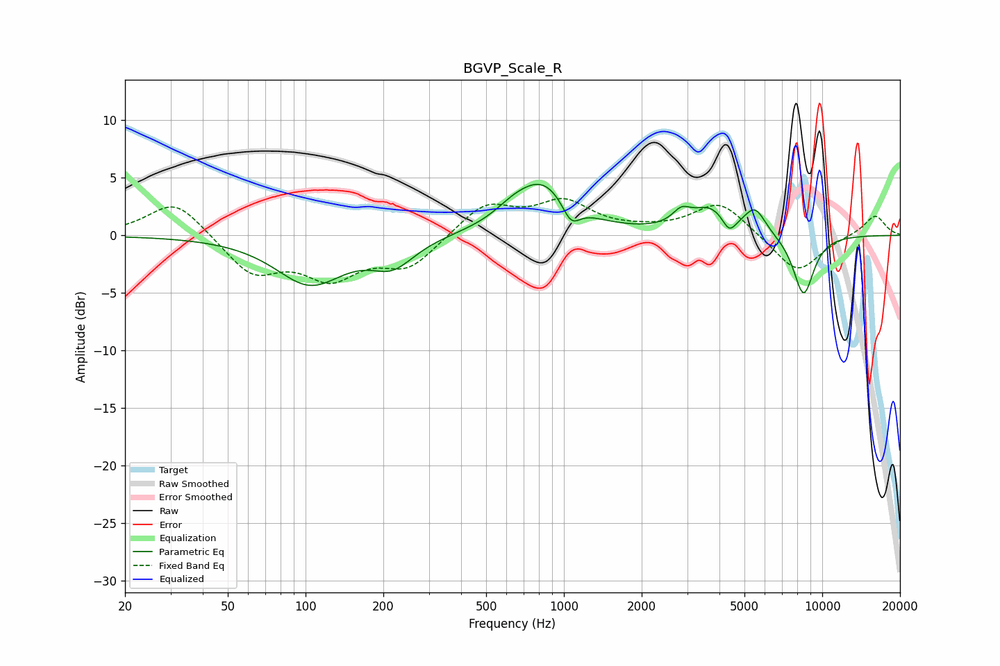

# BGVP_Scale_R
See [usage instructions](https://github.com/jaakkopasanen/AutoEq#usage) for more options and info.

### Parametric EQs
Apply preamp of -4.5 dB when using parametric equalizer.

|   # | Type    |   Fc (Hz) |    Q |   Gain (dB) |
|-----|---------|-----------|------|-------------|
|   1 | Peaking |       104 | 1.07 |        -4.1 |
|   2 | Peaking |       217 | 1.7  |        -2.2 |
|   3 | Peaking |       630 | 2.13 |         0.7 |
|   4 | Peaking |       827 | 1.24 |         4.5 |
|   5 | Peaking |      1065 | 3.99 |        -1.9 |
|   6 | Peaking |      2850 | 4.12 |         1.1 |
|   7 | Peaking |      3714 | 1.78 |         2.3 |
|   8 | Peaking |      4363 | 4.94 |        -1.5 |
|   9 | Peaking |      5496 | 3.4  |         2.1 |
|  10 | Peaking |      8467 | 3.17 |        -5.3 |

### Fixed Band EQs
When using fixed band (also called graphic) equalizer, apply preamp of **-3.3 dB** (if available) and set gains manually with these parameters.

|   # | Type    |   Fc (Hz) |    Q |   Gain (dB) |
|-----|---------|-----------|------|-------------|
|   1 | Peaking |        31 | 1.41 |         3.2 |
|   2 | Peaking |        62 | 1.41 |        -3.3 |
|   3 | Peaking |       125 | 1.41 |        -3.3 |
|   4 | Peaking |       250 | 1.41 |        -2.7 |
|   5 | Peaking |       500 | 1.41 |         2.7 |
|   6 | Peaking |      1000 | 1.41 |         2.7 |
|   7 | Peaking |      2000 | 1.41 |         0.2 |
|   8 | Peaking |      4000 | 1.41 |         2.9 |
|   9 | Peaking |      8000 | 1.41 |        -3.3 |
|  10 | Peaking |     16000 | 1.41 |         1.8 |

### Graphs

