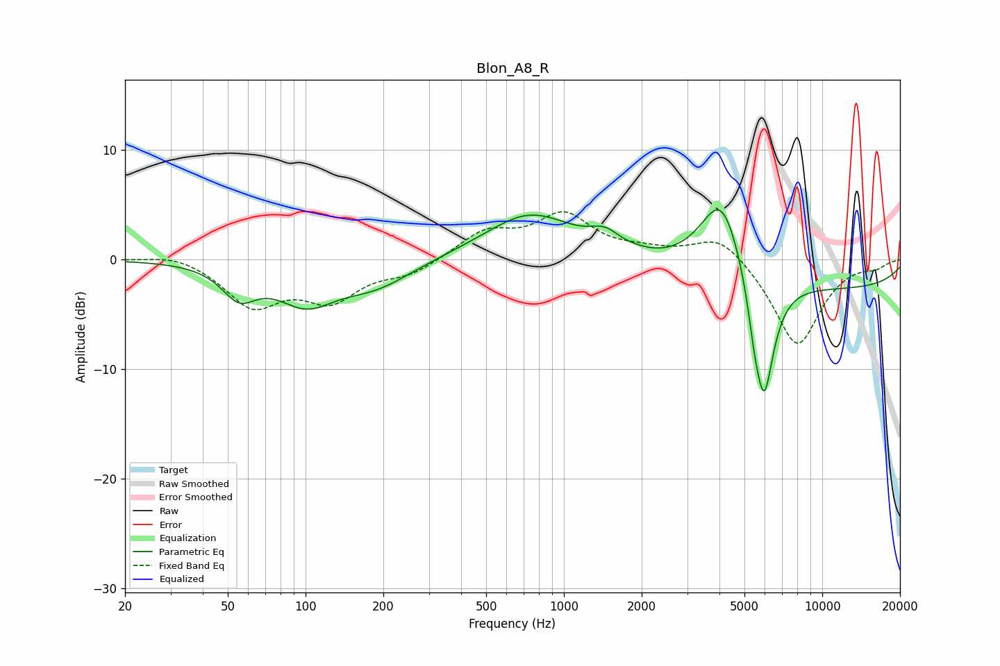

# Blon_A8_R
See [usage instructions](https://github.com/jaakkopasanen/AutoEq#usage) for more options and info.

### Parametric EQs
Apply preamp of -4.6 dB when using parametric equalizer.

|   # | Type    |   Fc (Hz) |    Q |   Gain (dB) |
|-----|---------|-----------|------|-------------|
|   1 | Peaking |        55 | 2.16 |        -2.8 |
|   2 | Peaking |       100 | 1.22 |        -3.5 |
|   3 | Peaking |       187 | 0.98 |        -2.2 |
|   4 | Peaking |       741 | 0.81 |         4.2 |
|   5 | Peaking |      1444 | 2.43 |         1.4 |
|   6 | Peaking |      1918 | 2.96 |         0.1 |
|   7 | Peaking |      4082 | 1.65 |         7.8 |
|   8 | Peaking |      5454 | 5.67 |        -2.2 |
|   9 | Peaking |      5948 | 3.33 |       -11.5 |
|  10 | Peaking |     10000 | 0.21 |        -2.7 |

### Fixed Band EQs
When using fixed band (also called graphic) equalizer, apply preamp of **-4.4 dB** (if available) and set gains manually with these parameters.

|   # | Type    |   Fc (Hz) |    Q |   Gain (dB) |
|-----|---------|-----------|------|-------------|
|   1 | Peaking |        31 | 1.41 |         0.7 |
|   2 | Peaking |        62 | 1.41 |        -4.1 |
|   3 | Peaking |       125 | 1.41 |        -3.4 |
|   4 | Peaking |       250 | 1.41 |        -1.2 |
|   5 | Peaking |       500 | 1.41 |         2.4 |
|   6 | Peaking |      1000 | 1.41 |         3.8 |
|   7 | Peaking |      2000 | 1.41 |         0.6 |
|   8 | Peaking |      4000 | 1.41 |         2.4 |
|   9 | Peaking |      8000 | 1.41 |        -8   |
|  10 | Peaking |     16000 | 1.41 |        -0.6 |

### Graphs

