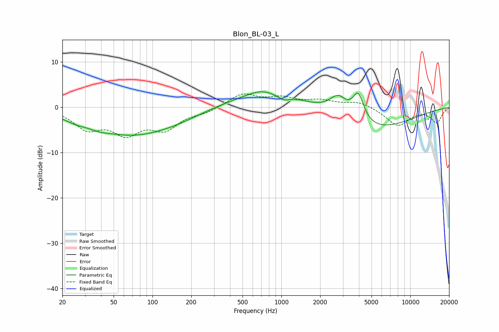

# Blon_BL-03_L
See [usage instructions](https://github.com/jaakkopasanen/AutoEq#usage) for more options and info.

### Parametric EQs
Apply preamp of -3.5 dB when using parametric equalizer.

|   # | Type    |   Fc (Hz) |    Q |   Gain (dB) |
|-----|---------|-----------|------|-------------|
|   1 | Peaking |        26 | 1.84 |        -0.8 |
|   2 | Peaking |        38 | 2.22 |        -0.6 |
|   3 | Peaking |        67 | 0.44 |        -5.8 |
|   4 | Peaking |       159 | 0.68 |        -1   |
|   5 | Peaking |       692 | 1.53 |         1   |
|   6 | Peaking |       923 | 0.39 |         3.7 |
|   7 | Peaking |      1040 | 3.01 |        -1.2 |
|   8 | Peaking |      2764 | 1.96 |         4.5 |
|   9 | Peaking |      3945 | 3.16 |         6.2 |
|  10 | Peaking |      4531 | 0.44 |        -5.7 |

### Fixed Band EQs
When using fixed band (also called graphic) equalizer, apply preamp of **-3.1 dB** (if available) and set gains manually with these parameters.

|   # | Type    |   Fc (Hz) |    Q |   Gain (dB) |
|-----|---------|-----------|------|-------------|
|   1 | Peaking |        31 | 1.41 |        -4.3 |
|   2 | Peaking |        62 | 1.41 |        -5.1 |
|   3 | Peaking |       125 | 1.41 |        -4.3 |
|   4 | Peaking |       250 | 1.41 |        -1   |
|   5 | Peaking |       500 | 1.41 |         2.9 |
|   6 | Peaking |      1000 | 1.41 |         1.8 |
|   7 | Peaking |      2000 | 1.41 |         1.3 |
|   8 | Peaking |      4000 | 1.41 |         1.3 |
|   9 | Peaking |      8000 | 1.41 |        -4   |
|  10 | Peaking |     16000 | 1.41 |        -3.3 |

### Graphs

