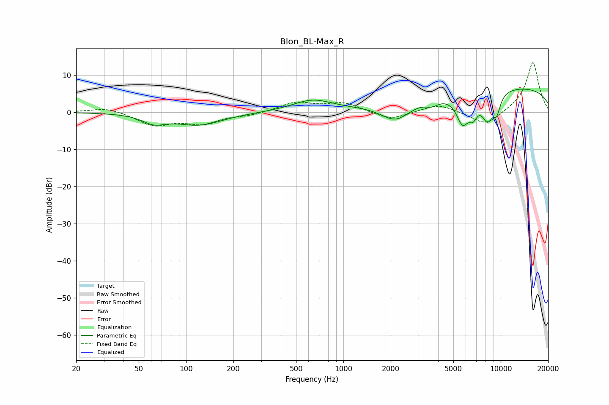

# Blon_BL-Max_R
See [usage instructions](https://github.com/jaakkopasanen/AutoEq#usage) for more options and info.

### Parametric EQs
Apply preamp of -6.3 dB when using parametric equalizer.

|   # | Type    |   Fc (Hz) |    Q |   Gain (dB) |
|-----|---------|-----------|------|-------------|
|   1 | Peaking |        63 | 1.96 |        -2.3 |
|   2 | Peaking |       121 | 0.94 |        -3.3 |
|   3 | Peaking |       635 | 1.11 |         3.1 |
|   4 | Peaking |      2159 | 1.45 |        -5.3 |
|   5 | Peaking |      3661 | 3.27 |        -1.6 |
|   6 | Peaking |      5719 | 3.31 |        -7.6 |
|   7 | Peaking |      6669 | 4.89 |        -3.8 |
|   8 | Peaking |      8250 | 3.27 |        -7.2 |
|   9 | Peaking |      9444 | 5.36 |        -4.3 |
|  10 | Peaking |     10000 | 0.18 |         7   |

### Fixed Band EQs
When using fixed band (also called graphic) equalizer, apply preamp of **-13.5 dB** (if available) and set gains manually with these parameters.

|   # | Type    |   Fc (Hz) |    Q |   Gain (dB) |
|-----|---------|-----------|------|-------------|
|   1 | Peaking |        31 | 1.41 |         1.4 |
|   2 | Peaking |        62 | 1.41 |        -3.4 |
|   3 | Peaking |       125 | 1.41 |        -2.8 |
|   4 | Peaking |       250 | 1.41 |        -0.8 |
|   5 | Peaking |       500 | 1.41 |         2.6 |
|   6 | Peaking |      1000 | 1.41 |         2.4 |
|   7 | Peaking |      2000 | 1.41 |        -2.2 |
|   8 | Peaking |      4000 | 1.41 |         2.3 |
|   9 | Peaking |      8000 | 1.41 |        -3.8 |
|  10 | Peaking |     16000 | 1.41 |        13.6 |

### Graphs

