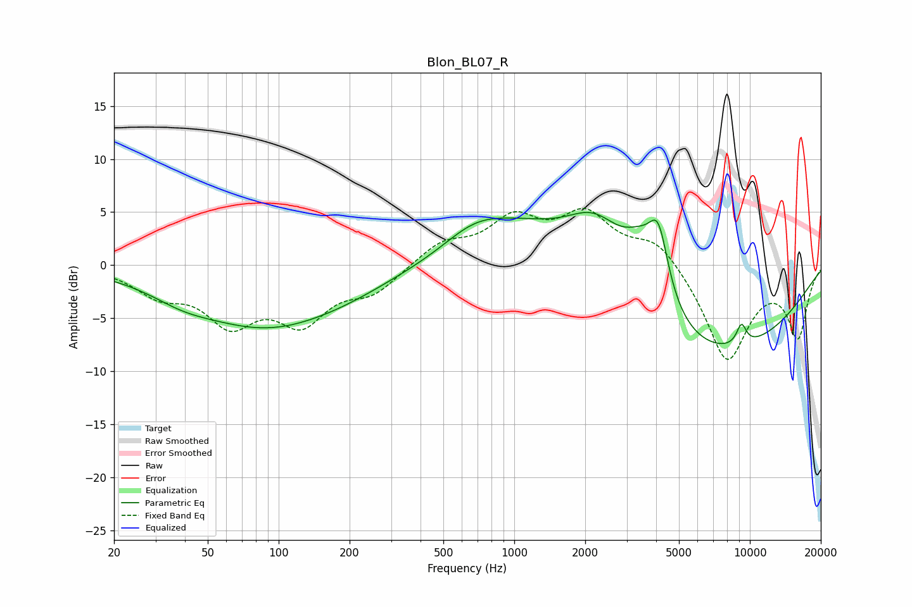

# Blon_BL07_R
See [usage instructions](https://github.com/jaakkopasanen/AutoEq#usage) for more options and info.

### Parametric EQs
Apply preamp of -5.1 dB when using parametric equalizer.

|   # | Type    |   Fc (Hz) |    Q |   Gain (dB) |
|-----|---------|-----------|------|-------------|
|   1 | Peaking |        39 | 1.08 |        -1   |
|   2 | Peaking |        88 | 0.46 |        -5.5 |
|   3 | Peaking |       195 | 0.71 |        -0.8 |
|   4 | Peaking |       680 | 0.98 |         2.7 |
|   5 | Peaking |      1117 | 0.67 |         4.1 |
|   6 | Peaking |      2215 | 0.88 |         8.6 |
|   7 | Peaking |      3458 | 1.65 |         4.6 |
|   8 | Peaking |      4096 | 3.32 |         5.9 |
|   9 | Peaking |      5186 | 0.25 |        -9.9 |
|  10 | Peaking |      9211 | 5.86 |         2   |

### Fixed Band EQs
When using fixed band (also called graphic) equalizer, apply preamp of **-5.4 dB** (if available) and set gains manually with these parameters.

|   # | Type    |   Fc (Hz) |    Q |   Gain (dB) |
|-----|---------|-----------|------|-------------|
|   1 | Peaking |        31 | 1.41 |        -2.4 |
|   2 | Peaking |        62 | 1.41 |        -4.9 |
|   3 | Peaking |       125 | 1.41 |        -4.8 |
|   4 | Peaking |       250 | 1.41 |        -2.3 |
|   5 | Peaking |       500 | 1.41 |         2   |
|   6 | Peaking |      1000 | 1.41 |         4   |
|   7 | Peaking |      2000 | 1.41 |         4.4 |
|   8 | Peaking |      4000 | 1.41 |         2.5 |
|   9 | Peaking |      8000 | 1.41 |        -9   |
|  10 | Peaking |     16000 | 1.41 |        -6.5 |

### Graphs

