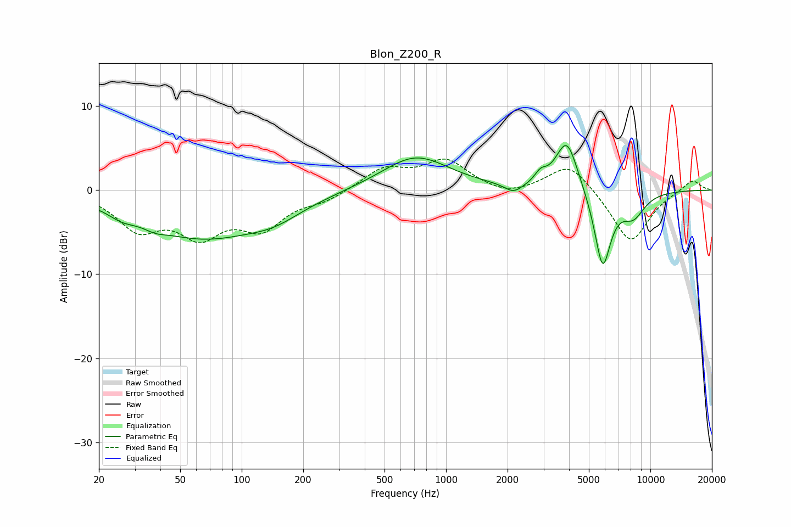

# Blon_Z200_R
See [usage instructions](https://github.com/jaakkopasanen/AutoEq#usage) for more options and info.

### Parametric EQs
Apply preamp of -5.4 dB when using parametric equalizer.

|   # | Type    |   Fc (Hz) |    Q |   Gain (dB) |
|-----|---------|-----------|------|-------------|
|   1 | Peaking |        26 | 2.18 |        -0.9 |
|   2 | Peaking |        38 | 2.79 |        -0.6 |
|   3 | Peaking |        64 | 0.47 |        -5.5 |
|   4 | Peaking |       145 | 1.07 |        -1.4 |
|   5 | Peaking |       710 | 0.86 |         4.1 |
|   6 | Peaking |      2140 | 3.18 |        -1.1 |
|   7 | Peaking |      2900 | 5.04 |         1.1 |
|   8 | Peaking |      3900 | 2.53 |         6.2 |
|   9 | Peaking |      5838 | 3.32 |        -9.3 |
|  10 | Peaking |      8247 | 2.28 |        -2.7 |

### Fixed Band EQs
When using fixed band (also called graphic) equalizer, apply preamp of **-3.8 dB** (if available) and set gains manually with these parameters.

|   # | Type    |   Fc (Hz) |    Q |   Gain (dB) |
|-----|---------|-----------|------|-------------|
|   1 | Peaking |        31 | 1.41 |        -4.2 |
|   2 | Peaking |        62 | 1.41 |        -4.7 |
|   3 | Peaking |       125 | 1.41 |        -4.1 |
|   4 | Peaking |       250 | 1.41 |        -1.1 |
|   5 | Peaking |       500 | 1.41 |         2.5 |
|   6 | Peaking |      1000 | 1.41 |         3.4 |
|   7 | Peaking |      2000 | 1.41 |        -0.9 |
|   8 | Peaking |      4000 | 1.41 |         3.4 |
|   9 | Peaking |      8000 | 1.41 |        -6.4 |
|  10 | Peaking |     16000 | 1.41 |         1.4 |

### Graphs

