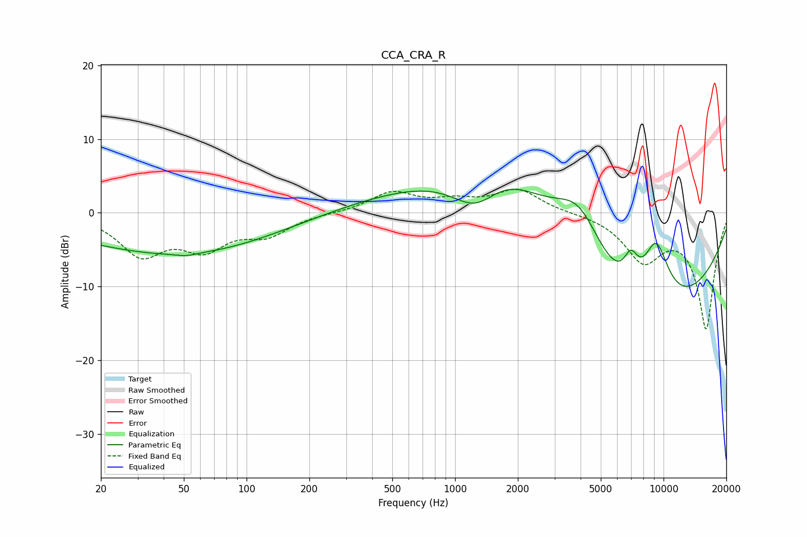

# CCA_CRA_R
See [usage instructions](https://github.com/jaakkopasanen/AutoEq#usage) for more options and info.

### Parametric EQs
Apply preamp of -3.3 dB when using parametric equalizer.

|   # | Type    |   Fc (Hz) |    Q |   Gain (dB) |
|-----|---------|-----------|------|-------------|
|   1 | Peaking |        38 | 0.18 |        -2.5 |
|   2 | Peaking |        51 | 3.15 |        -0.3 |
|   3 | Peaking |        54 | 0.35 |        -4.2 |
|   4 | Peaking |       164 | 0.18 |         1.4 |
|   5 | Peaking |      1264 | 1.14 |        -5.9 |
|   6 | Peaking |      1630 | 0.48 |        12.5 |
|   7 | Peaking |      3943 | 1.05 |         8.8 |
|   8 | Peaking |      6979 | 3.76 |         3.8 |
|   9 | Peaking |      7182 | 0.28 |       -18.2 |
|  10 | Peaking |      9193 | 1.82 |         9.7 |

### Fixed Band EQs
When using fixed band (also called graphic) equalizer, apply preamp of **-3.3 dB** (if available) and set gains manually with these parameters.

|   # | Type    |   Fc (Hz) |    Q |   Gain (dB) |
|-----|---------|-----------|------|-------------|
|   1 | Peaking |        31 | 1.41 |        -5.4 |
|   2 | Peaking |        62 | 1.41 |        -4.2 |
|   3 | Peaking |       125 | 1.41 |        -2.7 |
|   4 | Peaking |       250 | 1.41 |        -0   |
|   5 | Peaking |       500 | 1.41 |         2.7 |
|   6 | Peaking |      1000 | 1.41 |         1.3 |
|   7 | Peaking |      2000 | 1.41 |         3.1 |
|   8 | Peaking |      4000 | 1.41 |         0   |
|   9 | Peaking |      8000 | 1.41 |        -6   |
|  10 | Peaking |     16000 | 1.41 |       -15.6 |

### Graphs

