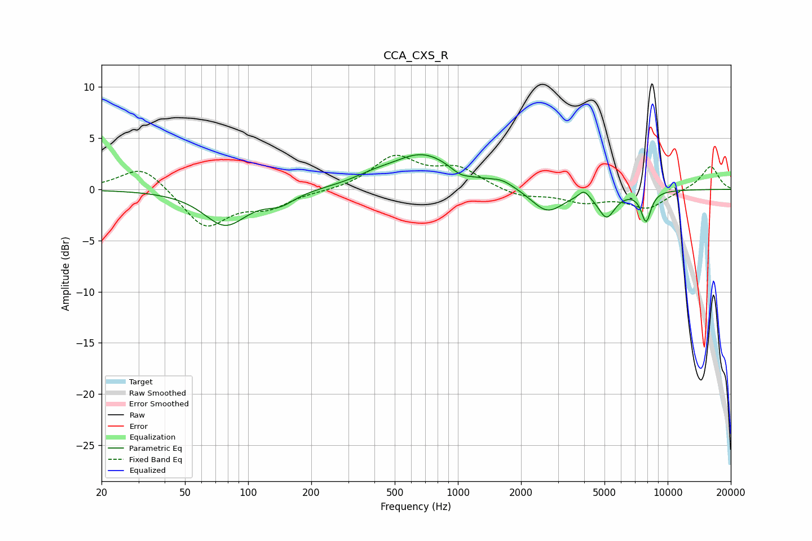

# CCA_CXS_R
See [usage instructions](https://github.com/jaakkopasanen/AutoEq#usage) for more options and info.

### Parametric EQs
Apply preamp of -3.5 dB when using parametric equalizer.

|   # | Type    |   Fc (Hz) |    Q |   Gain (dB) |
|-----|---------|-----------|------|-------------|
|   1 | Peaking |        78 | 1.38 |        -3.4 |
|   2 | Peaking |       142 | 2.03 |        -1.1 |
|   3 | Peaking |       395 | 1.46 |         0.5 |
|   4 | Peaking |       682 | 0.93 |         3.4 |
|   5 | Peaking |      1030 | 3.16 |        -0.6 |
|   6 | Peaking |      1625 | 2.41 |         0.6 |
|   7 | Peaking |      2670 | 1.84 |        -2.3 |
|   8 | Peaking |      3994 | 5.61 |         0.8 |
|   9 | Peaking |      5117 | 3.47 |        -2.5 |
|  10 | Peaking |      7890 | 5.6  |        -2.9 |

### Fixed Band EQs
When using fixed band (also called graphic) equalizer, apply preamp of **-3.4 dB** (if available) and set gains manually with these parameters.

|   # | Type    |   Fc (Hz) |    Q |   Gain (dB) |
|-----|---------|-----------|------|-------------|
|   1 | Peaking |        31 | 1.41 |         2.5 |
|   2 | Peaking |        62 | 1.41 |        -3.7 |
|   3 | Peaking |       125 | 1.41 |        -1.5 |
|   4 | Peaking |       250 | 1.41 |        -0.1 |
|   5 | Peaking |       500 | 1.41 |         3.1 |
|   6 | Peaking |      1000 | 1.41 |         1.9 |
|   7 | Peaking |      2000 | 1.41 |        -0.8 |
|   8 | Peaking |      4000 | 1.41 |        -1.1 |
|   9 | Peaking |      8000 | 1.41 |        -1.8 |
|  10 | Peaking |     16000 | 1.41 |         2.3 |

### Graphs

