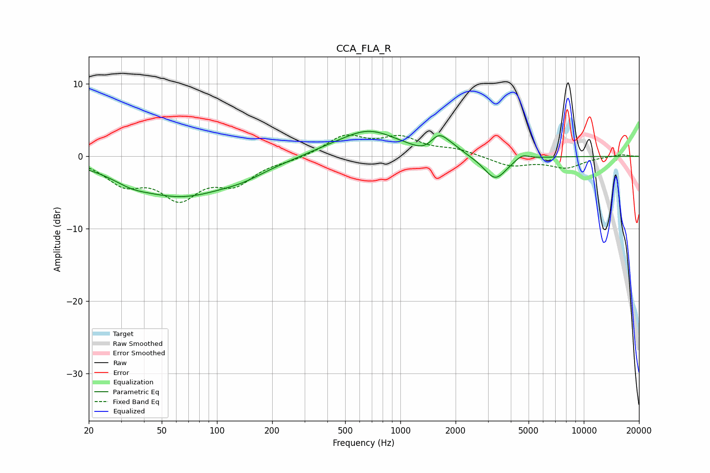

# CCA_FLA_R
See [usage instructions](https://github.com/jaakkopasanen/AutoEq#usage) for more options and info.

### Parametric EQs
Apply preamp of -3.6 dB when using parametric equalizer.

|   # | Type    |   Fc (Hz) |    Q |   Gain (dB) |
|-----|---------|-----------|------|-------------|
|   1 | Peaking |        34 | 1.53 |        -0.9 |
|   2 | Peaking |        64 | 0.52 |        -5.3 |
|   3 | Peaking |       139 | 1.16 |        -0.9 |
|   4 | Peaking |       380 | 1.19 |         0.4 |
|   5 | Peaking |       670 | 0.88 |         3.5 |
|   6 | Peaking |      1358 | 2.4  |        -0.8 |
|   7 | Peaking |      1624 | 2.88 |         2.3 |
|   8 | Peaking |      1941 | 2.46 |         0.7 |
|   9 | Peaking |      3291 | 2.27 |        -3.3 |
|  10 | Peaking |      4615 | 3.93 |         0.8 |

### Fixed Band EQs
When using fixed band (also called graphic) equalizer, apply preamp of **-3.1 dB** (if available) and set gains manually with these parameters.

|   # | Type    |   Fc (Hz) |    Q |   Gain (dB) |
|-----|---------|-----------|------|-------------|
|   1 | Peaking |        31 | 1.41 |        -3.3 |
|   2 | Peaking |        62 | 1.41 |        -5.2 |
|   3 | Peaking |       125 | 1.41 |        -3.3 |
|   4 | Peaking |       250 | 1.41 |        -0.4 |
|   5 | Peaking |       500 | 1.41 |         2.7 |
|   6 | Peaking |      1000 | 1.41 |         2.3 |
|   7 | Peaking |      2000 | 1.41 |         0.8 |
|   8 | Peaking |      4000 | 1.41 |        -1.3 |
|   9 | Peaking |      8000 | 1.41 |        -1.5 |
|  10 | Peaking |     16000 | 1.41 |         0.3 |

### Graphs

