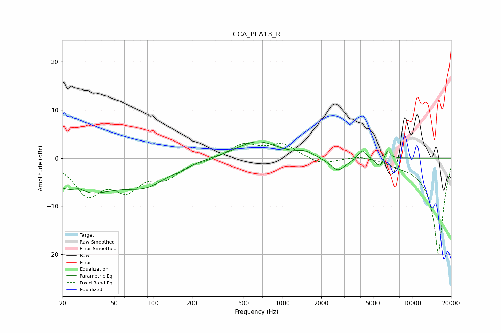

# CCA_PLA13_R
See [usage instructions](https://github.com/jaakkopasanen/AutoEq#usage) for more options and info.

### Parametric EQs
Apply preamp of -3.5 dB when using parametric equalizer.

|   # | Type    |   Fc (Hz) |    Q |   Gain (dB) |
|-----|---------|-----------|------|-------------|
|   1 | Peaking |        27 | 3.19 |         1.1 |
|   2 | Peaking |        28 | 0.51 |        -7.1 |
|   3 | Peaking |        91 | 0.87 |        -3.9 |
|   4 | Peaking |       165 | 2.63 |        -0.5 |
|   5 | Peaking |       634 | 0.91 |         3.5 |
|   6 | Peaking |      1487 | 2.38 |         0.9 |
|   7 | Peaking |      2678 | 2.37 |        -2.8 |
|   8 | Peaking |      4140 | 4.92 |         2   |
|   9 | Peaking |      5663 | 4.39 |        -2   |
|  10 | Peaking |      6454 | 6    |         2.1 |

### Fixed Band EQs
When using fixed band (also called graphic) equalizer, apply preamp of **-3.1 dB** (if available) and set gains manually with these parameters.

|   # | Type    |   Fc (Hz) |    Q |   Gain (dB) |
|-----|---------|-----------|------|-------------|
|   1 | Peaking |        31 | 1.41 |        -7.1 |
|   2 | Peaking |        62 | 1.41 |        -5.6 |
|   3 | Peaking |       125 | 1.41 |        -3.5 |
|   4 | Peaking |       250 | 1.41 |        -0.4 |
|   5 | Peaking |       500 | 1.41 |         2.8 |
|   6 | Peaking |      1000 | 1.41 |         2.8 |
|   7 | Peaking |      2000 | 1.41 |        -1.4 |
|   8 | Peaking |      4000 | 1.41 |         0.7 |
|   9 | Peaking |      8000 | 1.41 |        -0.6 |
|  10 | Peaking |     16000 | 1.41 |       -20   |

### Graphs

