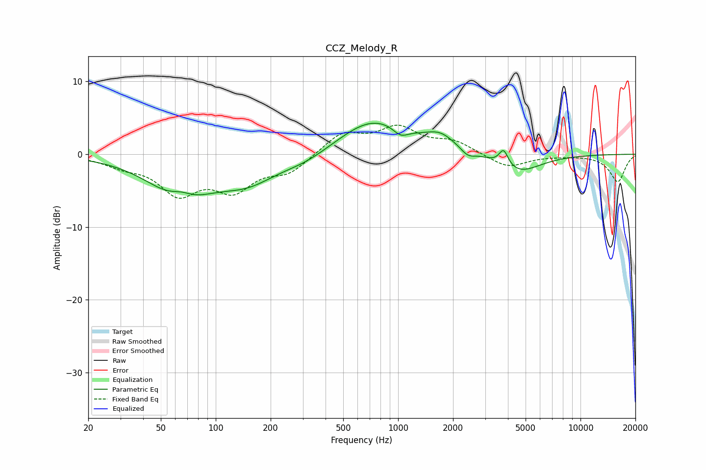

# CCZ_Melody_R
See [usage instructions](https://github.com/jaakkopasanen/AutoEq#usage) for more options and info.

### Parametric EQs
Apply preamp of -4.4 dB when using parametric equalizer.

|   # | Type    |   Fc (Hz) |    Q |   Gain (dB) |
|-----|---------|-----------|------|-------------|
|   1 | Peaking |        64 | 0.84 |        -5.8 |
|   2 | Peaking |        65 | 2.18 |         1.4 |
|   3 | Peaking |       150 | 0.89 |        -3.1 |
|   4 | Peaking |       312 | 0.99 |        -1.3 |
|   5 | Peaking |       733 | 0.73 |         4.9 |
|   6 | Peaking |      1033 | 3.37 |        -1.2 |
|   7 | Peaking |      1706 | 1.77 |         1.8 |
|   8 | Peaking |      2408 | 3.75 |        -0.9 |
|   9 | Peaking |      3790 | 5.63 |         2.3 |
|  10 | Peaking |      4537 | 1.15 |        -2.6 |

### Fixed Band EQs
When using fixed band (also called graphic) equalizer, apply preamp of **-4.1 dB** (if available) and set gains manually with these parameters.

|   # | Type    |   Fc (Hz) |    Q |   Gain (dB) |
|-----|---------|-----------|------|-------------|
|   1 | Peaking |        31 | 1.41 |        -1.3 |
|   2 | Peaking |        62 | 1.41 |        -5   |
|   3 | Peaking |       125 | 1.41 |        -4.4 |
|   4 | Peaking |       250 | 1.41 |        -2.3 |
|   5 | Peaking |       500 | 1.41 |         2.9 |
|   6 | Peaking |      1000 | 1.41 |         3.4 |
|   7 | Peaking |      2000 | 1.41 |         1.6 |
|   8 | Peaking |      4000 | 1.41 |        -1.9 |
|   9 | Peaking |      8000 | 1.41 |        -0.1 |
|  10 | Peaking |     16000 | 1.41 |        -3.8 |

### Graphs

