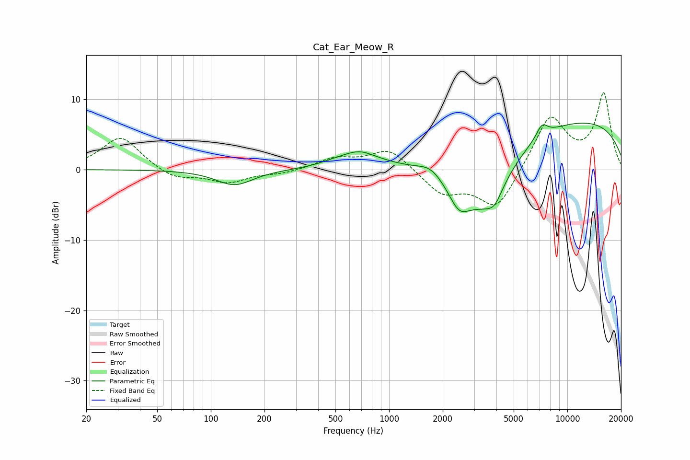

# Cat_Ear_Meow_R
See [usage instructions](https://github.com/jaakkopasanen/AutoEq#usage) for more options and info.

### Parametric EQs
Apply preamp of -6.7 dB when using parametric equalizer.

|   # | Type    |   Fc (Hz) |    Q |   Gain (dB) |
|-----|---------|-----------|------|-------------|
|   1 | Peaking |       136 | 1.37 |        -2.2 |
|   2 | Peaking |       487 | 1.59 |         0.4 |
|   3 | Peaking |       693 | 1.3  |         2.4 |
|   4 | Peaking |       808 | 2.78 |        -0.2 |
|   5 | Peaking |      1699 | 2.33 |         1   |
|   6 | Peaking |      2466 | 2.21 |        -4.1 |
|   7 | Peaking |      3528 | 0.97 |        -8.8 |
|   8 | Peaking |      3909 | 3.56 |        -1.5 |
|   9 | Peaking |      7210 | 4.15 |         1.8 |
|  10 | Peaking |      9928 | 0.21 |         7.3 |

### Fixed Band EQs
When using fixed band (also called graphic) equalizer, apply preamp of **-11.0 dB** (if available) and set gains manually with these parameters.

|   # | Type    |   Fc (Hz) |    Q |   Gain (dB) |
|-----|---------|-----------|------|-------------|
|   1 | Peaking |        31 | 1.41 |         4.7 |
|   2 | Peaking |        62 | 1.41 |        -1.4 |
|   3 | Peaking |       125 | 1.41 |        -1.8 |
|   4 | Peaking |       250 | 1.41 |        -0.5 |
|   5 | Peaking |       500 | 1.41 |         1.5 |
|   6 | Peaking |      1000 | 1.41 |         3   |
|   7 | Peaking |      2000 | 1.41 |        -3.3 |
|   8 | Peaking |      4000 | 1.41 |        -5.7 |
|   9 | Peaking |      8000 | 1.41 |         7.7 |
|  10 | Peaking |     16000 | 1.41 |        10.6 |

### Graphs

